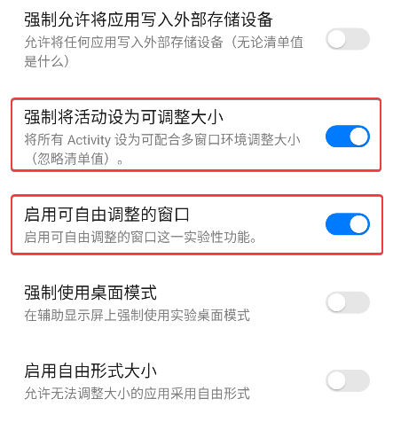
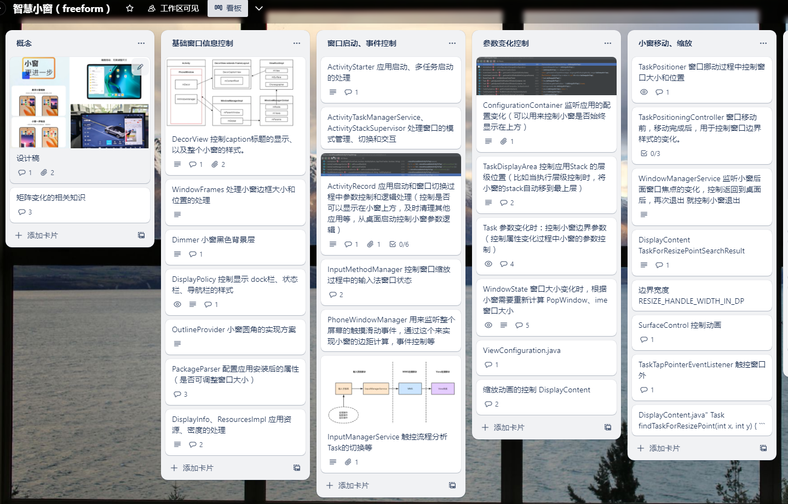

# Android13深入了解 Android 小窗口模式和窗口类型


小窗模式，作为一种在移动设备上的多任务处理方式，为用户带来了便捷和高效的体验，尤其在一些特定场景下，其价值愈发凸显。以下是为什么需要小窗模式的一些重要原因：

1. **内容复制和跨应用操作：** 小窗模式允许用户轻松从一个应用（A应用）复制内容到另一个应用（B应用），而无需频繁切换应用。这在迁移微信聊天记录或在不同应用之间共享信息时非常有用。用户可以在小窗口中查看和编辑信息，然后将其粘贴到目标应用，这大大提高了效率。

2. **无缝切换和即用即走：** 在某些情况下，用户可能需要临时使用一个应用程序（B应用），而不想完全离开当前应用程序（A应用）。小窗模式允许用户在不中断A应用的情况下快速访问B应用，然后无缝返回A应用。这对于查看实时信息或快速执行任务非常有用，如叫滴滴后查看司机位置。

3. **多任务处理和注意力分配：** 当用户需要在一个应用程序（A应用）中保持关注，并且还需要时不时地检查另一个应用程序（B应用）的更新时，小窗模式非常有用。用户可以将B应用以小窗口的形式浮动在A应用上方，无需频繁切换，从而更好地分配注意力，减轻焦虑情绪。

4. **快速回复和记录：** 在看网课、玩游戏或执行其他任务时，用户可能会收到消息或需要记录笔记。小窗模式允许用户在小窗口中轻松回复消息或记笔记，而不必退出当前应用程序。这提高了多任务处理的效率。

5. **心理负担减轻：** 频繁切换应用程序可能会导致用户分散注意力，增加心理负担，甚至产生焦虑情绪。小窗模式的引入可以减轻这种心理负担，使用户更轻松地处理多个任务。

总的来说，小窗模式为用户提供了更灵活、高效和愉悦的应用程序管理和多任务处理方式。在日常生活和工作中，小窗模式可以极大地提高用户的生产力和用户体验，成为了现代移动设备不可或缺的功能之一。不仅如此，众多Android操作系统制造商也在不断迭代和优化小窗模式，以满足用户不断变化的需求。


本文主要是对原生的自由窗口模式进行一个代码分析，具体各家的小窗效果，可以参考这篇文章：  
[小米、华为、OPPO……五大 Android 系统横向对比，谁的「小窗模式」最好用？](https://www.ifanr.com/1414244)

## 小窗开启方式

### 开发者模式下开启小窗功能
开发者模式下打开如下两个开关，然后重启即可。



### adb 手动开启
```bash
adb shell settings put global enable_freeform_support  1
adb shell settings put global force_resizable_activities  1
```

### 源码配置
- copy file
```bash
# add for freedom
PRODUCT_COPY_FILES += \
   frameworks/native/data/etc/android.software.freeform_window_management.xml:$(TARGET_COPY_OUT_SYSTEM)/etc/permissions/android.software.freeform_window_management.xml
```
- overlay
```xml
    <!-- add for freeform -->
    <bool name="config_freeformWindowManagement">true</bool>
```

## 小窗的启动方式
主要的启动方式，一个是多任务里面，点击应用图标，选择小窗模式，另一个是通过三方应用启动，比如侧边栏，通知栏等待。

### 三方应用通过 ActivityOptions 启动
```java
    public void startFreeFormActivity(View view) {
        Intent intent = new Intent(this, FreeFormActivity.class);
        ActivityOptions options = ActivityOptions.makeBasic();
        options.setLaunchWindowingMode(WINDOWING_MODE_FREEFORM);
        startActivity(intent, options.toBundle());
    }
```

### 多任务启动
通过长按应用图标，选择小窗模式，ActivityOptions 会设置 `ActivityOptions#setLaunchWindowingMode` 为 `WINDOWING_MODE_FREEFORM`，然后通过 `ActivityManager#startActivity` 启动 Activity。

```java {2529-2545} {2529} (https://github.com/10cl/fwkdev/blob/5a60c2297130856b92c1f3afbbdff8d3ae90233c//dev/src/frameworks/base/services/core/java/com/android/server/wm/ActivityTaskSupervisor.java?#L2529-L2545)
    int startActivityFromRecents(int callingPid, int callingUid, int taskId,
            SafeActivityOptions options) {
        final Task task;
        final int taskCallingUid;
        final String callingPackage;
        final String callingFeatureId;
        final Intent intent;
        final int userId;
        final ActivityOptions activityOptions = options != null
                ? options.getOptions(this)
                : null;
        boolean moveHomeTaskForward = true;
        synchronized (mService.mGlobalLock) {
            int activityType = ACTIVITY_TYPE_UNDEFINED;
            if (activityOptions != null) {
                activityType = activityOptions.getLaunchActivityType();
                final int windowingMode = activityOptions.getLaunchWindowingMode();
```
[/dev/src/frameworks/base/services/core/java/com/android/server/wm/ActivityTaskSupervisor.java?#L2529-L2545](https://github.com/10cl/fwkdev/blob/5a60c2297130856b92c1f3afbbdff8d3ae90233c//dev/src/frameworks/base/services/core/java/com/android/server/wm/ActivityTaskSupervisor.java?#L2529-L2545)

### 应用兼容
应用需要设置 `android:resizeableActivity="true"`，应用安装过程中会解析`AndroidManifest.xml`，并设置 `PackageParser.ActivityInfo` 的 `privateFlags`，在启动应用的时候，会根据 `privateFlags` 的值来判断是否支持小窗。

```java {3623-3631} {3623} (https://github.com/10cl/fwkdev/blob/5a60c2297130856b92c1f3afbbdff8d3ae90233c//dev/src/frameworks/base/core/java/android/content/pm/PackageParser.java?#L3623-L3631)
        if (sa.hasValueOrEmpty(R.styleable.AndroidManifestApplication_resizeableActivity)) {
            if (sa.getBoolean(R.styleable.AndroidManifestApplication_resizeableActivity, true)) {
                ai.privateFlags |= PRIVATE_FLAG_ACTIVITIES_RESIZE_MODE_RESIZEABLE;
            } else {
                ai.privateFlags |= PRIVATE_FLAG_ACTIVITIES_RESIZE_MODE_UNRESIZEABLE;
            }
        } else if (owner.applicationInfo.targetSdkVersion >= Build.VERSION_CODES.N) {
            ai.privateFlags |= PRIVATE_FLAG_ACTIVITIES_RESIZE_MODE_RESIZEABLE_VIA_SDK_VERSION;
        }
```
[/dev/src/frameworks/base/core/java/android/content/pm/PackageParser.java?#L3623-L3631](https://github.com/10cl/fwkdev/blob/5a60c2297130856b92c1f3afbbdff8d3ae90233c//dev/src/frameworks/base/core/java/android/content/pm/PackageParser.java?#L3623-L3631)

## 基础的窗口信息
在Android 系统中，窗口是应用程序界面的基本单元，用于承载和显示应用的视图内容。每个 `Activity` 都有一个主窗口，但也可以有其他窗口，如对话框、悬浮窗等。

在应用上层的一些组件的体现上，变化不是很大，但是 `Framework` 中的对于窗口的管理，迭代变化一直都比较大，可能之前有的类，新的架构下就被精简了，所以主要掌握窗口的一些概念，这样比较容易在新的架构之下找到对应的实现。

这里先回顾一下基础的窗口和界面相关的概念： 
1. **Window（窗口）：** 窗口是应用程序界面的基本单元，用于承载和显示应用的视图内容。每个 `Activity` 都有一个主窗口，但也可以有其他窗口，如对话框、悬浮窗等。
2. **WindowManagerService：** 是 Android 系统中的窗口管理服务，负责管理窗口的创建、显示、移动、调整大小、层级关系等。它是 Android 窗口系统的核心组件。
3. **View（视图）：** `View` 是 Android 中用户界面的基本构建块，用于在窗口中绘制和显示内容。它是窗口中可见元素的基础。
4. **ViewGroup（视图组）：** `ViewGroup` 是一种特殊的 `View`，它可以包含其他视图（包括 `View` 和其他 `ViewGroup`）来形成复杂的用户界面。
5. **Surface（表面）：** `Surface` 是用于绘制图形内容的区域，窗口和视图内容都可以在 `Surface` 上绘制。每个窗口通常对应一个 `Surface`。
6. **SurfaceFlinger：** 是 Android 系统中的一个组件，负责管理和合成窗口中的 `Surface`，以及在屏幕上绘制这些 `Surface`。
7. **LayoutParams（布局参数）：** `LayoutParams` 是窗口或视图的布局参数，用于指定视图在其父视图中的位置、大小和外观等。
8. **Window Token（窗口令牌）：** `Window Token` 是一个用于标识窗口所属于的应用程序或任务的对象。它在窗口的显示和交互中起着重要作用。
9. **Window Decor（窗口装饰）：** `Window Decor` 是窗口的装饰元素，如标题栏、状态栏等，可以影响窗口的外观和交互。
10. **Dialog（对话框）：** 对话框是一种特殊的窗口，用于在当前活动之上显示临时的提示、选择或输入内容。
11. **Activity（活动）**： 在 Android 应用程序中，每个 Activity 都与一个 PhoneWindow 相关联。PhoneWindow 用于管理 Activity 的界面绘制和交互。
12. **Window Callback（窗口回调）**： `PhoneWindow` 实现了 Window.Callback 接口，该接口用于处理窗口事件和交互。通过实现这个接口，您可以监听和响应窗口的状态变化、输入事件等。
13. **DecorView（装饰视图）**： PhoneWindow 中的内容通常由 `DecorView` 承载。DecorView 是一个特殊的 `ViewGroup`，用于包含应用程序的用户界面内容和窗口装饰元素，如标题栏、状态栏等。
14. **PhoneWindow（应用程序窗口）**： `PhoneWindow` 是 `android.view.Window` 类的实现之一，用于表示一个应用程序窗口。它提供了窗口的基本功能，如绘制、布局、装饰、焦点管理等。

## 窗口类型
```java {107-121} {109,119} (https://github.com/10cl/fwkdev/blob/5a60c2297130856b92c1f3afbbdff8d3ae90233c//dev/src/frameworks/base/core/java/android/app/WindowConfiguration.java?#L107-L121)
    /** Can be freely resized within its parent container. */ /** 可以在其父容器中自由调整大小。 */
    // TODO: Remove once freeform is migrated to wm-shell.
    public static final int WINDOWING_MODE_FREEFORM = 5;
    /** Generic multi-window with no presentation attribution from the window manager. */
    public static final int WINDOWING_MODE_MULTI_WINDOW = 6;

    /** @hide */
    @IntDef(prefix = { "WINDOWING_MODE_" }, value = {
            WINDOWING_MODE_UNDEFINED,
            WINDOWING_MODE_FULLSCREEN,
            WINDOWING_MODE_MULTI_WINDOW,
            WINDOWING_MODE_PINNED,
            WINDOWING_MODE_FREEFORM,
    })
    public @interface WindowingMode {}
```
[/dev/src/frameworks/base/core/java/android/app/WindowConfiguration.java?#L107-L121](https://github.com/10cl/fwkdev/blob/5a60c2297130856b92c1f3afbbdff8d3ae90233c//dev/src/frameworks/base/core/java/android/app/WindowConfiguration.java?#L107-L121)


1. **WINDOWING_MODE_FULLSCREEN（全屏窗口模式）：**

    * 全屏窗口模式是最常见的窗口模式之一。在这种模式下，应用程序的窗口占据整个屏幕，并且通常用于运行单个应用程序，以全屏方式呈现内容。这是最常见的模式，特别是用于媒体播放和游戏应用。
2. **WINDOWING_MODE_MULTI_WINDOW（多窗口模式）：**

    * 多窗口模式允许多个应用程序在屏幕上并排显示，用户可以同时查看和操作多个应用程序。这种模式通常在平板电脑和大屏幕设备上使用，以提高多任务处理能力。在多窗口模式下，应用程序可以以分割屏幕或浮动窗口的形式并存，使用户能够轻松切换和互操作不同的应用程序。
3. **WINDOWING_MODE_PINNED（固定窗口模式）：**

    * 固定窗口模式是一种特殊的模式，允许用户将一个应用程序窗口锁定在屏幕上，使其悬浮在其他应用程序之上。这对于创建“固定”应用程序，如屏幕时间限制或导航应用程序，以及在特定任务期间保持一个应用程序窗口可见非常有用。
4. **WINDOWING_MODE_FREEFORM（自由窗口模式）：**

    * 自由窗口模式是一种灵活的窗口模式，它允许应用程序窗口自由调整大小和定位，就像在桌面操作系统中一样。这种模式使用户可以在屏幕上创建自定义布局，以满足其特定需求。自由窗口模式通常在大屏幕设备上使用，如平板电脑，以提供更多的窗口管理自由度。

这些窗口模式提供了不同的用户体验和多任务处理方式，使Android设备适应了各种不同的使用情境和设备类型。


## 小窗 


原生的小窗属于 `WINDOWING_MODE_FREEFORM`，对于目前大部分国内厂商而言，在`WindowConfiguration` 的窗口类型的基础上，自定义一个 `WINDOWING_MODE_XXX`，具体逻辑也是参考小窗的窗口类型，用于实现自己的小窗的功能。
相比原生的小窗，国内厂商实现的小窗支持的功能和动画效果更加丰富，但是原理大致是一样的，核心的区别就是窗口的边界，自定义的窗口一般是通过矩阵变化中的缩放实现将应用从大屏幕到小屏，保留了原始的长宽比，这样就不会出现变形的情况并且能够兼容所有的应用。
而原生的实现，主要是对应用边界的控制，长宽比不固定，并且将边界切到很小的时候，这样会让应用显示不完全，并且窗口类型需要应用提前定义为 `resizeableActivity` 可支持缩放。

通过`dumpsys window`可以看到小窗的`Task`状态,`bounds` 表示窗口的边界， 一个是`mode`字段描述窗口类型.
```java {6,7}
  Task display areas in top down Z order:
    TaskDisplayArea DefaultTaskDisplayArea
      mPreferredTopFocusableRootTask=Task{1595f4c #23 type=standard A=10130:com.youku.phone U=0 visible=true visibleRequested=true mode=freeform translucent=false sz=1}
      mLastFocusedRootTask=Task{1595f4c #23 type=standard A=10130:com.youku.phone U=0 visible=true visibleRequested=true mode=freeform translucent=false sz=1}
      Application tokens in top down Z order:
      * Task{1595f4c #23 type=standard A=10130:com.youku.phone U=0 visible=true visibleRequested=true mode=freeform translucent=false sz=1}
        bounds=[50,50][553,991]
        * ActivityRecord{aec2841 u0 com.youku.phone/com.youku.v2.HomePageEntry} t23 d0}
```


### 小窗生成
小窗主要在 `DecorCaptionView` 中处理， `Activity -> PhoneWindow -> DecorView -> DecorCaptionView`，相比 `DecorView` 多了一个 **Caption（标题栏）**。

建立的条件有两种:  
    一个在 `PhoneWindow` 建立的时候，创建 `DecorView`，`DecorView` 会判断是否要创建一个 `DecorCaptionView`。  
    第二个就是在 `DecorView` 中动态变化中，有参数变量，通过`onWindowSystemUiVisibilityChanged`（View的可见性变化） 以及 `onConfigurationChanged`（各种触发配置变化的条件） 的回调，实现对`DecorView` 进行是否要新建一个小窗的视图。

在 DecorView 中主要处理了小窗的参数变化，以及标题栏的显示与隐藏。

```java {2179-2200} {2179} (https://github.com/10cl/fwkdev/blob/5a60c2297130856b92c1f3afbbdff8d3ae90233c//dev/src/frameworks/base/core/java/com/android/internal/policy/DecorView.java?#L2179-L2200)
    private void updateDecorCaptionStatus(Configuration config) {
        final boolean displayWindowDecor = config.windowConfiguration.hasWindowDecorCaption()
                && !isFillingScreen(config); // 如果定义窗口类型为小窗，且不是全屏模式, 则创建一个 DecorCaptionView 在 DecorView 内部。
        if (mDecorCaptionView == null && displayWindowDecor) {
            // Configuration now requires a caption.
            final LayoutInflater inflater = mWindow.getLayoutInflater();
            mDecorCaptionView = createDecorCaptionView(inflater);
            if (mDecorCaptionView != null) {
                if (mDecorCaptionView.getParent() == null) {
                    addView(mDecorCaptionView, 0,
                            new ViewGroup.LayoutParams(MATCH_PARENT, MATCH_PARENT));
                }
                removeView(mContentRoot);
                mDecorCaptionView.addView(mContentRoot,
                        new ViewGroup.MarginLayoutParams(MATCH_PARENT, MATCH_PARENT));
            }
        } else if (mDecorCaptionView != null) { // 如果已经创建了 DecorCaptionView， 则更新配置信息，比如窗口大小，窗口位置等。
            // We might have to change the kind of surface before we do anything else.
            mDecorCaptionView.onConfigurationChanged(displayWindowDecor);
            enableCaption(displayWindowDecor); // 是否显示小窗的标题栏
        }
    }
```
[/dev/src/frameworks/base/core/java/com/android/internal/policy/DecorView.java?#L2179-L2200](https://github.com/10cl/fwkdev/blob/5a60c2297130856b92c1f3afbbdff8d3ae90233c//dev/src/frameworks/base/core/java/com/android/internal/policy/DecorView.java?#L2179-L2200)

### 小窗的标题栏
- 小窗的标题栏

```java {81-84} {83-84} (https://github.com/10cl/fwkdev/blob/5a60c2297130856b92c1f3afbbdff8d3ae90233c//dev/src/frameworks/base/core/java/com/android/internal/widget/DecorCaptionView.java?#L81-L84)
    private View mCaption;  // 标题栏
    private View mContent; // 小窗View之下，应用的根View
    private View mMaximize; // 最大化按钮
    private View mClose; // 关闭按钮
```
[/dev/src/frameworks/base/core/java/com/android/internal/widget/DecorCaptionView.java?#L81-L84](https://github.com/10cl/fwkdev/blob/5a60c2297130856b92c1f3afbbdff8d3ae90233c//dev/src/frameworks/base/core/java/com/android/internal/widget/DecorCaptionView.java?#L81-L84)

如果在应用的根View外部点击的话，就拦截事件往下传递，这样就不会触发应用的点击事件。
```java {525-544} {525} (https://github.com/10cl/fwkdev/blob/5a60c2297130856b92c1f3afbbdff8d3ae90233c//dev/src/frameworks/base/core/java/com/android/internal/policy/DecorView.java?#L525-L544)
    @Override
    public boolean onInterceptTouchEvent(MotionEvent event) {
        int action = event.getAction();
        if (mHasCaption && isShowingCaption()) { // 是否显示标题栏
            // Don't dispatch ACTION_DOWN to the captionr if the window is resizable and the event
            // was (starting) outside the window. Window resizing events should be handled by
            // WindowManager.  // 如果窗口可调整大小，并且事件是（开始）在窗口外部，则不要将 ACTION_DOWN 事件进行传递。窗口调整大小事件应由 WindowManager 处理。
            // TODO: Investigate how to handle the outside touch in window manager
            //       without generating these events.
            //       Currently we receive these because we need to enlarge the window's
            //       touch region so that the monitor channel receives the events
            //       in the outside touch area. // TODO: 了解如何在窗口管理器中处理外部触摸，而不会生成这些事件。当前，我们收到这些事件，因为我们需要扩大窗口的触摸区域，以便监视通道接收外部触摸区域中的事件。
            if (action == MotionEvent.ACTION_DOWN) {
                final int x = (int) event.getX();
                final int y = (int) event.getY();
                if (isOutOfInnerBounds(x, y)) {
                    return true;
                }
            }
        }
```
[/dev/src/frameworks/base/core/java/com/android/internal/policy/DecorView.java?#L525-L544](https://github.com/10cl/fwkdev/blob/5a60c2297130856b92c1f3afbbdff8d3ae90233c//dev/src/frameworks/base/core/java/com/android/internal/policy/DecorView.java?#L525-L544)

在小窗的View中，应用就不能通过View的事件来直接处理，DecorCaptionView 需要通过计算View所在的矩形区域，然后计算点击的区域是否处于该矩形区域范围内判断为点击，就是一个点和面的问题，原生小窗上的问题就是这个触控面太小，手指的点击区域可能不容易触发。
（在我开发的ChatDev游戏中，也有面和面碰撞的问题，玩家的位置和碰撞位置的计算）


**事件分发的流程**是这样的:
ViewGroup::dispatchTouchEvent -> ViewGroup::onInterceptTouchEvent -> ViewGroup::onTouchEvent -> View::dispatchTouchEvent -> View::onTouchEvent

这里 DecorCaptionView 通过`onInterceptTouchEvent` 拦截了事件用来实现触控。
```java {142-158} {142} (https://github.com/10cl/fwkdev/blob/5a60c2297130856b92c1f3afbbdff8d3ae90233c//dev/src/frameworks/base/core/java/com/android/internal/widget/DecorCaptionView.java?#L142-L158)
    @Override
    public boolean onInterceptTouchEvent(MotionEvent ev) {
        // If the user starts touch on the maximize/close buttons, we immediately intercept, so
        // that these buttons are always clickable.  // 如果用户点击最大化或者关闭按钮，就拦截事件，这样就不会触发应用的点击事件
        if (ev.getAction() == MotionEvent.ACTION_DOWN) {
            final int x = (int) ev.getX();
            final int y = (int) ev.getY();
            // Only offset y for containment tests because the actual views are already translated.
            if (mMaximizeRect.contains(x, y - mRootScrollY)) { // 是否点击到最大化按钮的区域
                mClickTarget = mMaximize;
            }
            if (mCloseRect.contains(x, y - mRootScrollY)) { // 是否点击到关闭按钮的区域
                mClickTarget = mClose;
            }
        }
        return mClickTarget != null;
    }
```
[/dev/src/frameworks/base/core/java/com/android/internal/widget/DecorCaptionView.java?#L142-L158](https://github.com/10cl/fwkdev/blob/5a60c2297130856b92c1f3afbbdff8d3ae90233c//dev/src/frameworks/base/core/java/com/android/internal/widget/DecorCaptionView.java?#L142-L158)

### 小窗的边界
目前国内的厂商的小窗设计，都是通过在`DecorView`里面模仿`DecorCaptionView`自定义一个`View`，用来作为小窗内部应用的容器。


- 边界圆角
一般会对这个小窗容器进行一个UI上的美化，主要的一个就是边界的圆角轮廓绘制。

常规的，圆角的实现主要是通过 `View` 的 `setOutlineProvider`， 然后在对自定义的 `DecorCaptionView` 上面绘制一个圆角的背景，这样就可以实现圆角的效果。

在 Android 中，`setOutlineProvider()` 是一个 View 的方法，可以用来为 `View` 设置一个 `OutlineProvider`。`OutlineProvider` 是一个抽象类，它提供了获取 View 轮廓的方法。通过设置 `OutlineProvider`，可以使 View 在绘制时具有特定的轮廓形状。
创建一个类继承自 `OutlineProvider`，并实现其 `getOutline()` 方法。在该方法中，可以通过调用 setRoundRect()、setOval() 等方法来设置不同的轮廓形状。

通过 `View.setOutlineProvider() `方法，将上一步创建的 `OutlineProvider` 实例设置给相应的 View。
在 `View` 的 `onDraw()` 方法中，可以利用 V`iew.getOutlineProvider()` 获取当前设置的 `OutlineProvider` 实例，从而获取 `View` 的轮廓，并将其绘制出来。

但是这样的实现方式，对于在小窗内部的 `View` 的绘制还是不可控，所以内部的View在可绘制的区域继续绘制矩形还是会出现显示问题。

- 导航栏重叠的问题

**DisplayPolicy** 作为系统里面控制显示 dock栏、状态栏、导航栏的样式的主要类， 
在每次绘制布局之后，都会走到如下`applyPostLayoutPolicyLw` 函数，进行显示规则的条件，当判断重叠之后，在导航栏更新透明度规则的时候，将其标记中不透明的纯深色背景和浅色前景清空。
```java {1585-1591} {1585} (https://github.com/10cl/fwkdev/blob/5a60c2297130856b92c1f3afbbdff8d3ae90233c//dev/src/frameworks/base/services/core/java/com/android/server/wm/DisplayPolicy.java?#L1585-L1591)

        // Check if the freeform window overlaps with the navigation bar area. // 检查自由窗口是否与导航栏区域重叠。
        if (!mIsFreeformWindowOverlappingWithNavBar && win.inFreeformWindowingMode()
                && win.mActivityRecord != null && isOverlappingWithNavBar(win)) {  // 如果窗口是自由窗口，并且窗口和导航栏重叠
            mIsFreeformWindowOverlappingWithNavBar = true;
        }

```
[/dev/src/frameworks/base/services/core/java/com/android/server/wm/DisplayPolicy.java?#L1585-L1591](https://github.com/10cl/fwkdev/blob/5a60c2297130856b92c1f3afbbdff8d3ae90233c//dev/src/frameworks/base/services/core/java/com/android/server/wm/DisplayPolicy.java?#L1585-L1591)

```java {2530-2546} {2530} (https://github.com/10cl/fwkdev/blob/5a60c2297130856b92c1f3afbbdff8d3ae90233c//dev/src/frameworks/base/services/core/java/com/android/server/wm/DisplayPolicy.java?#L2530-L2546)
    /**
     * @return the current visibility flags with the nav-bar opacity related flags toggled based
     *         on the nav bar opacity rules chosen by {@link #mNavBarOpacityMode}.
     */
    private int configureNavBarOpacity(int appearance, boolean multiWindowTaskVisible,
            boolean freeformRootTaskVisible) {
        final boolean drawBackground = drawsBarBackground(mNavBarBackgroundWindow);

        if (mNavBarOpacityMode == NAV_BAR_FORCE_TRANSPARENT) {
            if (drawBackground) {
                appearance = clearNavBarOpaqueFlag(appearance);
            }
        } else if (mNavBarOpacityMode == NAV_BAR_OPAQUE_WHEN_FREEFORM_OR_DOCKED) {
            if (multiWindowTaskVisible || freeformRootTaskVisible) {
                if (mIsFreeformWindowOverlappingWithNavBar) { // 如果自由窗口和导航栏重叠
                    appearance = clearNavBarOpaqueFlag(appearance); // 清除使导航栏变成不透明的纯深色背景和浅色前景。
                }
```
[/dev/src/frameworks/base/services/core/java/com/android/server/wm/DisplayPolicy.java?#L2530-L2546](https://github.com/10cl/fwkdev/blob/5a60c2297130856b92c1f3afbbdff8d3ae90233c//dev/src/frameworks/base/services/core/java/com/android/server/wm/DisplayPolicy.java?#L2530-L2546)

- 高度阴影问题
```java {2530-2555} {2530} (https://github.com/10cl/fwkdev/blob/5a60c2297130856b92c1f3afbbdff8d3ae90233c//dev/src/frameworks/base/core/java/com/android/internal/policy/DecorView.java?#L2530-L2555)
    private void updateElevation() {
        final int windowingMode =
                getResources().getConfiguration().windowConfiguration.getWindowingMode();
        final boolean renderShadowsInCompositor = mWindow.mRenderShadowsInCompositor;
        // If rendering shadows in the compositor, don't set an elevation on the view // 如果在合成器中渲染阴影，请不要在视图上设置高度
        if (renderShadowsInCompositor) {
            return;
        }
        float elevation = 0;
        final boolean wasAdjustedForStack = mElevationAdjustedForStack;
        // Do not use a shadow when we are in resizing mode (mBackdropFrameRenderer not null)
        // since the shadow is bound to the content size and not the target size. // 当我们处于调整大小模式（mBackdropFrameRenderer不为空）时不要使用阴影，因为阴影绑定到内容大小而不是目标大小。
        if ((windowingMode == WINDOWING_MODE_FREEFORM) && !isResizing()) {
            elevation = hasWindowFocus() ?
                    DECOR_SHADOW_FOCUSED_HEIGHT_IN_DIP : DECOR_SHADOW_UNFOCUSED_HEIGHT_IN_DIP; // 如果有焦点，则为DECOR_SHADOW_FOCUSED_HEIGHT_IN_DIP=20，否则为DECOR_SHADOW_UNFOCUSED_HEIGHT_IN_DIP=5
            // Add a maximum shadow height value to the top level view.
            // Note that pinned stack doesn't have focus
            // so maximum shadow height adjustment isn't needed. // 为顶级视图添加最大阴影高度值。注意，固定堆栈没有焦点，因此不需要最大阴影高度调整。
            // TODO(skuhne): Remove this if clause once b/22668382 got fixed.
            if (!mAllowUpdateElevation) {
                elevation = DECOR_SHADOW_FOCUSED_HEIGHT_IN_DIP;
            }
            // Convert the DP elevation into physical pixels.
            elevation = dipToPx(elevation);
            mElevationAdjustedForStack = true;
        }
```
[/dev/src/frameworks/base/core/java/com/android/internal/policy/DecorView.java?#L2530-L2555](https://github.com/10cl/fwkdev/blob/5a60c2297130856b92c1f3afbbdff8d3ae90233c//dev/src/frameworks/base/core/java/com/android/internal/policy/DecorView.java?#L2530-L2555)

### 小窗的背景
小窗的背景中，包含应用对View设置的背景资源 还有一个窗口容器外部存在一个调暗层（`DimLayer`）的背景，用于实现调暗的效果。

**Dimmer** 类的作用是为实现**窗口容器（`WindowContainer`）**添加“调暗层”（DimLayer）支持，通过在不同的 **Z 层级上**创建具有不同透明度的**黑色层**，从而实现调暗的效果。该类主要用于在窗口容器中管理和应用调暗效果。

该类的主要方法和功能如下：

- `dimAbove` 和 `dimBelow` 方法  
  这些方法用于在指定的窗口容器上方或下方添加调暗层。可以设置调暗层的透明度（alpha）和相对于指定容器的 Z 层级。

- `resetDimStates`
  该方法标记所有的调暗状态为等待下一次调用 updateDims 时完成。在调用子容器的 prepareSurfaces 之前调用此方法，以允许子容器继续请求保持调暗。

- **updateDims** 方法
  在调用子容器的 prepareSurfaces 后，通过此方法来更新调暗层的位置和尺寸。根据容器的更新，它可以设置调暗层的位置、大小以及调整动画。

- stopDim 方法
  用于停止调暗效果，可以在不再需要调暗时调用。

- 内部类 DimState
  表示调暗状态的内部类，包含调暗层的 SurfaceControl、调暗状态等信息。

`Dimmer` 类用于管理和应用调暗效果，使窗口容器在不同 Z 层级上添加透明度变化的调暗层，以达到调暗的效果。
在 Android 系统中用于处理窗口切换、过渡动画以及调整显示效果时很有用， 如果要对小窗进行圆角的处理，这一层也是要处理的， 不然会出现黑色矩形边的问题。


### 应用的启动
**startSpecificActivity** 方法的作用是启动指定的活动（Activity）实例。
这个方法通常用于特定的情况，例如当需要在特定任务中启动某个活动时，或者在特定的任务堆栈中启动活动。

具体来说，startSpecificActivity 方法的作用包括：

启动指定活动： 该方法允许开发者或系统通过提供特定的活动组件信息（如包名、类名）来启动特定的活动。

指定任务和堆栈： 该方法可以允许开发者或系统指定在哪个任务和堆栈中启动活动。这有助于将活动放置在预期的上下文中，如在多窗口模式中。

任务切换和前台切换： 在启动指定活动时，系统可能需要调整任务堆栈和前台任务。这可以用于在用户点击通知或从其他应用程序启动时，确保正确的任务切换和前台切换。

```java {1039-1068} {1039} (https://github.com/10cl/fwkdev/blob/5a60c2297130856b92c1f3afbbdff8d3ae90233c//dev/src/frameworks/base/services/core/java/com/android/server/wm/ActivityTaskSupervisor.java?#L1039-L1068)
    void startSpecificActivity(ActivityRecord r, boolean andResume, boolean checkConfig) {
        // Is this activity's application already running?
        final WindowProcessController wpc =
                mService.getProcessController(r.processName, r.info.applicationInfo.uid);

        boolean knownToBeDead = false;
        if (wpc != null && wpc.hasThread()) {
            try {
                realStartActivityLocked(r, wpc, andResume, checkConfig);
                return;
            } catch (RemoteException e) {
                Slog.w(TAG, "Exception when starting activity "
                        + r.intent.getComponent().flattenToShortString(), e);
            }

            // If a dead object exception was thrown -- fall through to
            // restart the application.
            knownToBeDead = true;
            // Remove the process record so it won't be considered as alive.
            mService.mProcessNames.remove(wpc.mName, wpc.mUid);
            mService.mProcessMap.remove(wpc.getPid());
        }

        r.notifyUnknownVisibilityLaunchedForKeyguardTransition();

        final boolean isTop = andResume && r.isTopRunningActivity();
        mService.startProcessAsync(r, knownToBeDead, isTop,
                isTop ? HostingRecord.HOSTING_TYPE_TOP_ACTIVITY
                        : HostingRecord.HOSTING_TYPE_ACTIVITY);
    }
```
[/dev/src/frameworks/base/services/core/java/com/android/server/wm/ActivityTaskSupervisor.java?#L1039-L1068](https://github.com/10cl/fwkdev/blob/5a60c2297130856b92c1f3afbbdff8d3ae90233c//dev/src/frameworks/base/services/core/java/com/android/server/wm/ActivityTaskSupervisor.java?#L1039-L1068)

### Task 的恢复

**resumeTopActivityUncheckedLocked** 是 Android 系统中 ActivityStack 类中的一个重要函数，它用于在堆栈中恢复位于顶部的活动（Activity）。这个函数主要用于活动的切换和前台任务的管理。

具体来说，resumeTopActivityUncheckedLocked 的作用包括：

活动恢复： 当一个活动需要从后台切换到前台时，这个函数负责执行恢复操作。它会执行活动的生命周期方法，如 onResume，以确保活动处于可见和活跃状态。

前台任务切换： 当用户切换到另一个任务时，或者当一个任务从后台切换到前台时，这个函数负责在不同的任务堆栈之间切换活动。它确保目标活动所在的任务堆栈处于前台，以便用户能够与其交互。

任务切换的恢复： 当前台任务从另一个任务切换回来时，系统需要确保前台任务的活动被正确恢复。这个函数负责在这种情况下的活动切换和恢复。

多窗口模式支持： 如果设备支持多窗口模式，这个函数也会在多窗口切换时被调用，以确保活动在不同窗口模式之间正确切换和恢复。

## 边界

### 内部边界的计算

在Android Framework中，**WindowState** 是用于表示窗口状态的一个类。
窗口状态是指应用程序窗口在屏幕上的显示状态，包括位置、大小、可见性等。

**computeFrame**方法是WindowState类中的一个重要方法，用于计算窗口的位置和大小。具体来说，它负责计算窗口的绘制区域，即窗口的内容在屏幕上实际显示的位置和大小。这个计算涉及到考虑窗口的位置、大小、布局参数以及可能的边界限制，确保窗口内容不会超出屏幕边界或被其他窗口遮挡。

在窗口管理器中，computeFrame方法通常会在以下情况被调用：

当窗口第一次被创建时，需要计算其初始位置和大小。
当窗口的布局参数或内容发生变化时，需要重新计算窗口的位置和大小。
当屏幕旋转或大小变化等系统事件发生时，需要调整所有窗口的位置和大小。
总之，computeFrame方法在Android窗口管理系统中起到了非常重要的作用，确保应用程序窗口能够正确地在屏幕上显示，并且适应不同的设备和系统事件, 为了计算小窗的位置，以及处理小窗内的View 的边界异常情况，
通常我们需要对 **WindowFrames** 是一个表示窗口边框大小和位置的类进行适当的处理。

其中，mFrame、mVisibleFrame、mDecorFrame、mDisplayFrame 是 WindowFrames 中的一些成员变量，用于描述不同的窗口区域。
- mFrame 表示窗口在屏幕上的位置和大小，是窗口管理和界面绘制的基础依据。
- mVisibleFrame 表示窗口可见区域的位置和大小，即除去状态栏和导航栏等系统 UI 元素后，窗口实际可以显示的区域。
- mDecorFrame 表示窗口装饰区域的位置和大小，即窗口除去实际内容区域外，包含的标题栏、边框、按钮等 UI 元素所占用的空间。
- **mDisplayFrame** 表示整个屏幕的可见区域的位置和大小，也就是说它包含了状态栏和导航栏等系统 UI 元素。

这些成员变量共同描述了窗口在屏幕中的位置和大小，并提供给其他模块使用，比如 WindowManager 和 View 系统。
在 Android Framework 中，WindowManagerService 会在每次窗口大小发生变化时，调用 WindowFrames 的 setFrames() 方法，更新这些成员变量的值。


### 窗口边界
在 `Task` 类中有一个比较重要的函数，`prepareSurfaces`, 通常是在窗口或界面元素绘制之前被调用的一个方法，用于**准备和更新**与绘制相关的表面（**Surface**）的状态。
和窗口相关的系统类，这里梳理一下需要了解的关键继承关系：
```java
- WindowContainer::prepareSurfaces
    - public class DisplayArea<T extends WindowContainer> extends WindowContainer<T> {
    - class RootWindowContainer extends WindowContainer<DisplayContent>
    - class TaskFragment extends WindowContainer<WindowContainer> {
        - class Task extends TaskFragment {
    - class WindowContainer<E extends WindowContainer> extends ConfigurationContainer<E>
    - class WindowState extends WindowContainer<WindowState> implements WindowManagerPolicy.WindowState,
    - class WindowToken extends WindowContainer<WindowState> {
```

- prepareSurfaceLocked 执行堆栈
```java
prepareSurfaceLocked:472, WindowStateAnimator (com.android.server.wm)
prepareSurfaces:5653, WindowState (com.android.server.wm)
prepareSurfaces:2669, WindowContainer (com.android.server.wm)
prepareSurfaces:7327, ActivityRecord (com.android.server.wm)
prepareSurfaces:2669, WindowContainer (com.android.server.wm)
prepareSurfaces:2639, TaskFragment (com.android.server.wm)
prepareSurfaces:3323, Task (com.android.server.wm)
prepareSurfaces:2669, WindowContainer (com.android.server.wm)
prepareSurfaces:2669, WindowContainer (com.android.server.wm)
prepareSurfaces:2669, WindowContainer (com.android.server.wm)
prepareSurfaces:2669, WindowContainer (com.android.server.wm)
prepareSurfaces:2669, WindowContainer (com.android.server.wm)
prepareSurfaces:662, DisplayArea$Dimmable (com.android.server.wm)
prepareSurfaces:2669, WindowContainer (com.android.server.wm)
prepareSurfaces:662, DisplayArea$Dimmable (com.android.server.wm)
prepareSurfaces:5242, DisplayContent (com.android.server.wm)
applySurfaceChangesTransaction:4717, DisplayContent (com.android.server.wm)
applySurfaceChangesTransaction:1025, RootWindowContainer (com.android.server.wm)
performSurfacePlacementNoTrace:828, RootWindowContainer (com.android.server.wm)
performSurfacePlacement:788, RootWindowContainer (com.android.server.wm)
performSurfacePlacementLoop:177, WindowSurfacePlacer (com.android.server.wm)
performSurfacePlacement:126, WindowSurfacePlacer (com.android.server.wm)
performSurfacePlacement:115, WindowSurfacePlacer (com.android.server.wm)
handleMessage:5680, WindowManagerService$H (com.android.server.wm)
dispatchMessage:106, Handler (android.os)
loopOnce:201, Looper (android.os)
loop:288, Looper (android.os)
run:67, HandlerThread (android.os)
run:44, ServiceThread (com.android.server)
```

```java {3306-3319} {3306} (https://github.com/10cl/fwkdev/blob/5a60c2297130856b92c1f3afbbdff8d3ae90233c//dev/src/frameworks/base/services/core/java/com/android/server/wm/Task.java?#L3306-L3319)
    @Override
    void prepareSurfaces() {
        mDimmer.resetDimStates();
        super.prepareSurfaces();
        getDimBounds(mTmpDimBoundsRect);

        // Bounds need to be relative, as the dim layer is a child. // 边界需要是相对的，因为暗层是子层。
        if (inFreeformWindowingMode()) {
            getBounds(mTmpRect);
            mTmpDimBoundsRect.offsetTo(mTmpDimBoundsRect.left - mTmpRect.left,
                    mTmpDimBoundsRect.top - mTmpRect.top); // 处理调暗层的偏移边界
        } else {
            mTmpDimBoundsRect.offsetTo(0, 0);
        }
```
[/dev/src/frameworks/base/services/core/java/com/android/server/wm/Task.java?#L3306-L3319](https://github.com/10cl/fwkdev/blob/5a60c2297130856b92c1f3afbbdff8d3ae90233c//dev/src/frameworks/base/services/core/java/com/android/server/wm/Task.java?#L3306-L3319)

`prepareSurfaces` 在**图形渲染**和**显示过程**中发挥着重要作用，确保绘制的界面元素能够正确显示和交互。
正常有这些状态下会调用 `prepareSurfaces` 函数：

- Surface 的创建和配置： 在界面元素即将绘制之前，prepareSurfaces 函数可能会创建、配置或更新相关的 Surface。这可能包括在绘制过程中使用的后备 Surface 或用于渲染特定视图的 Surface。

- 更新界面状态： 该函数通常用于更新界面元素的状态，如位置、大小、可见性等。这可以确保界面元素在绘制之前具有正确的状态。

- 表面层级设置： prepareSurfaces 通常会设置不同 Surface 之间的层级关系，以确保它们按照正确的顺序绘制。这对于实现叠加效果、混合效果和窗口层次等非常重要。

- 调暗效果的管理： 在一些情况下，prepareSurfaces 可能会用于管理调暗效果，如前一个问题中提到的 Dimmer 类。在绘制前调整表面的透明度和位置，以达到调暗的效果。

- 动画和过渡准备： 如果有动画或过渡效果，prepareSurfaces 可能会在绘制之前对表面进行适当的准备，以确保动画效果的正确执行。

- 性能优化： prepareSurfaces 也可以用于性能优化，例如准备绘制所需的材料、纹理或缓冲区，以避免在实际绘制时出现延迟。


### 触控区域的优化
`DisplayContent` 类的一个方法，名为 `processTaskForTouchExcludeRegion`。
处理任务的触摸排除区域，以确保在处理触摸事件时不会影响到特定区域，例如任务之间的间隙或任务的边界。以下是对代码的逐行分析和大致功能的解释：

```java {3167-3212} {3167} (https://github.com/10cl/fwkdev/blob/5a60c2297130856b92c1f3afbbdff8d3ae90233c//dev/src/frameworks/base/services/core/java/com/android/server/wm/DisplayContent.java?#L3167-L3212)
private void processTaskForTouchExcludeRegion(Task task, Task focusedTask, int delta) {
        final ActivityRecord topVisibleActivity = task.getTopVisibleActivity();

        if (topVisibleActivity == null || !topVisibleActivity.hasContentToDisplay()) { // 检查顶部可见活动是否存在，以及该活动是否有内容需要显示。如果没有，就跳过后续处理。
            return;
        }

        // Exclusion region is the region that TapDetector doesn't care about.
        // Here we want to remove all non-focused tasks from the exclusion region.
        // We also remove the outside touch area for resizing for all freeform
        // tasks (including the focused).
        // We save the focused task region once we find it, and add it back at the end.
        // If the task is root home task and it is resizable and visible (top of its root task),
        // we want to exclude the root docked task from touch so we need the entire screen area
        // and not just a small portion which the root home task currently is resized to. // 如果任务是根主页任务，并且它是可调整大小的并且可见的（在其根任务的顶部），我们希望从触摸中排除根停靠任务，因此我们需要整个屏幕区域而不仅仅是根主页任务当前调整大小的一小部分。
        if (task.isActivityTypeHome() && task.isVisible() && task.isResizeable()) {
            task.getDisplayArea().getBounds(mTmpRect);
        } else {
            task.getDimBounds(mTmpRect); // 获取任务的调整边界（维度边界）
        }

        if (task == focusedTask) {
            // Add the focused task rect back into the exclude region once we are done
            // processing root tasks.
            // NOTE: this *looks* like a no-op, but this usage of mTmpRect2 is expected by
            //       updateTouchExcludeRegion.
            mTmpRect2.set(mTmpRect); // 将当前任务的边界复制到临时矩形 mTmpRect2， 用于后续的更新操作。
        }

        final boolean isFreeformed = task.inFreeformWindowingMode();
        if (task != focusedTask || isFreeformed) {
            if (isFreeformed) {
                // If the task is freeformed, enlarge the area to account for outside
                // touch area for resize. // 如果任务是小窗模式，则扩大该区域以考虑调整大小的外部触摸区域。
                mTmpRect.inset(-delta, -delta);
                // Intersect with display content frame. If we have system decor (status bar/
                // navigation bar), we want to exclude that from the tap detection.
                // Otherwise, if the app is partially placed under some system button (eg.
                // Recents, Home), pressing that button would cause a full series of
                // unwanted transfer focus/resume/pause, before we could go home.
                mTmpRect.inset(getInsetsStateController().getRawInsetsState().calculateInsets(
                        mTmpRect, systemBars() | ime(), false /* ignoreVisibility */)); // 调整任务边界，以排除系统装饰（如状态栏、导航栏）和输入法区域的影响。
            }
            mTouchExcludeRegion.op(mTmpRect, Region.Op.DIFFERENCE); // 将调整后的任务边界与触摸排除区域进行排除操作，以确保触摸事件不会影响到此区域。
        }
    }
```
[/dev/src/frameworks/base/services/core/java/com/android/server/wm/DisplayContent.java?#L3167-L3212](https://github.com/10cl/fwkdev/blob/5a60c2297130856b92c1f3afbbdff8d3ae90233c//dev/src/frameworks/base/services/core/java/com/android/server/wm/DisplayContent.java?#L3167-L3212)

### 拖拽
借助 Android 拖放框架，您可以向应用中添加交互式拖放功能。通过拖放，用户可以在应用中的 View 之间复制或拖动文本、图片、对象（可以通过 URI 表示的任何内容），也可以使用多窗口模式在应用之间拖动这些内容。


https://developer.android.google.cn/guide/topics/ui/drag-drop?hl=en

`DragState` 类主要用于管理和跟踪拖拽操作的状态。拖拽操作通常涉及用户在屏幕上拖动某个视图或对象，并在特定位置释放它。以下是 `DragState` 类的主要作用和功能：

1. **管理拖拽动作的状态**：`DragState` 类负责跟踪拖拽操作的各个状态，例如开始拖拽、拖拽中、拖拽结束等。它可以存储和更新与拖拽状态相关的信息。

2. **处理拖拽手势**：这个类可能包含了处理用户拖拽手势的逻辑，例如监测用户手指的移动、计算拖拽物体的位置、响应用户的拖拽操作等。

3. **协调拖拽操作**：`DragState` 类可能与其他系统组件（如窗口管理器或视图系统）协同工作，以确保拖拽操作在屏幕上正确执行。它可能需要调整被拖拽物体的位置，更新UI，或者触发其他操作。

4. **提供拖拽状态信息**：这个类通常会提供有关拖拽状态的信息，例如拖拽物体的位置、拖拽的类型、拖拽的源对象等。这些信息可以供其他组件使用。

5. **处理拖拽的释放**：当用户释放拖拽物体时，`DragState` 类可能需要执行特定的操作，例如将拖拽物体放置在新的位置、触发操作、或者完成拖拽操作。

6. **支持拖拽的可视化效果**：在一些情况下，`DragState` 类可能需要管理与拖拽相关的可视化效果，例如拖拽物体的影子或者拖拽物体的预览。

```java
DragState
    notifyLocationLocked(float, float)
            WindowState touchedWin = mDisplayContent.getTouchableWinAtPointLocked(x, y);
    notifyDropLocked(float, float)
            final WindowState touchedWin = mDisplayContent.getTouchableWinAtPointLocked(x, y);
WindowManagerService
    updatePointerIcon(IWindow)
                        displayContent.getTouchableWinAtPointLocked(mouseX, mouseY);
    restorePointerIconLocked(DisplayContent, float, float)
                    displayContent.getTouchableWinAtPointLocked(latestX, latestY);
```


### 移动
在小窗模式下，可以通过长按小窗的标题栏，然后拖动到屏幕的任意位置，这个过程中会调用 `moveTaskToStack`，具体实现如下：


### 焦点的变化

## Task的管理
目前从 Android12 开始，Android Framework逐步将`Stack`的概念切换为`Task`了，比如之前的 `ActivityStackSupervisor` 变成了 `ActivityTaskSupervisor`, `ActivitStack` 也变成了 `Task`,
在之前的版本上，也两个概念也同步存在一段时间。

**ActivityTaskManagerService** 是系统中负责管理应用程序的任务（**Task**）和活动（**Activity**）。
它在Android系统中起到了调度和管理应用程序的核心角色。 主要作用有：

- 任务管理： 该服务负责管理多个应用程序任务的生命周期。任务是一组相关活动的集合，通常代表了一个用户在应用程序之间的导航路径。例如，用户在浏览器中打开一个网页，然后从浏览器跳转到电子邮件应用，这两个活动会被归为一个任务。任务管理器确保任务在切换活动或返回到最近使用的任务时得以恢复。

- 活动管理： 该服务负责管理单个活动的生命周期。活动是应用程序用户界面的基本单元，包含用户与应用程序交互的界面元素。`ActivityTaskManagerService`确保活动在需要时正确创建、暂停、恢复、销毁等。

- 任务切换和前台应用管理： 当用户切换应用程序或任务时，`ActivityTaskManagerService`协调活动之间的切换，以及确保前台应用程序的正确管理。前台应用是当前用户正在与之交互的应用程序，而后台应用则是在后台运行的应用程序。

- 多窗口支持： Android系统中的一些设备支持多窗口模式，允许用户在同一屏幕上同时运行多个应用程序。`ActivityTaskManagerService`负责管理多窗口模式下的任务和活动排列。

- 任务堆栈管理： `ActivityTaskManagerService`管理应用程序任务的堆栈，以便在不同任务之间进行切换。这确保用户能够流畅地在不同应用程序之间切换，并且系统能够适当地处理返回键等用户导航操作。

它用来确保应用程序任务和活动的正确管理、切换和交互，从而提供了良好的用户体验。

**ActivityTaskSupervisor** 在 **ActivityTaskManagerService** 共同管理的应用程序任务和活动，它是 **ActivityManagerService** 的一部分，用于协调和管理任务的生命周期、任务切换、多窗口模式等方面的功能。
```java {159-164} {159} (https://github.com/10cl/fwkdev/blob/5a60c2297130856b92c1f3afbbdff8d3ae90233c//dev/src/frameworks/base/services/core/java/com/android/server/wm/ActivityTaskSupervisor.java?#L159-L164)
// TODO: This class has become a dumping ground. Let's
// - Move things relating to the hierarchy to RootWindowContainer
// - Move things relating to activity life cycles to maybe a new class called ActivityLifeCycler
// - Move interface things to ActivityTaskManagerService.
// - All other little things to other files.
public class ActivityTaskSupervisor implements RecentTasks.Callbacks {
```
[/dev/src/frameworks/base/services/core/java/com/android/server/wm/ActivityTaskSupervisor.java?#L159-L164](https://github.com/10cl/fwkdev/blob/5a60c2297130856b92c1f3afbbdff8d3ae90233c//dev/src/frameworks/base/services/core/java/com/android/server/wm/ActivityTaskSupervisor.java?#L159-L164)


在新的结构中，将一些功能从 **ActivityTaskSupervisor** 中移除，分别放到 `ActivityTaskManagerService`、`RootWindowContainer` 和 `ActivityLifeCycler` 中，使得 ActivityTaskSupervisor 只保留一些核心功能，从而使得代码更加清晰。


### 模式切换
小窗右上角点击切换全屏应用，会从小窗的模式变成应用全屏的模式，切换的逻辑从 `DecorCaptionView`中 调用`toggleFreeformWindowingMode`，在Android13之前通过 **ActivityTaskManagerService** 来实现，在
Android12之后新增了一个系统类`ActivityClientController`(在服务端实现，用于客户端活动与系统交互，避免了之前在应用层调用系统服务的时候，之前直接调用的客户端需要自行处理`RemoteException`以及其他多余的逻辑，这里增加了一层封装，提高了效率)，在ActivityClientController中新增了一个方法`toggleFreeformWindowingMode`，用于切换小窗和全屏的模式，具体实现如下：

[/dev/src/frameworks/base/services/core/java/com/android/server/wm/ActivityClientController.java?#L96-L101](https://github.com/10cl/fwkdev/blob/5a60c2297130856b92c1f3afbbdff8d3ae90233c//dev/src/frameworks/base/services/core/java/com/android/server/wm/ActivityClientController.java?#L96-L101)

```java {993-1020} {1018-1019} (https://github.com/10cl/fwkdev/blob/5a60c2297130856b92c1f3afbbdff8d3ae90233c//dev/src/frameworks/base/services/core/java/com/android/server/wm/ActivityClientController.java?#L993-L1020)
    @Override
    public void toggleFreeformWindowingMode(IBinder token) { // 
        final long ident = Binder.clearCallingIdentity();
        try {
            synchronized (mGlobalLock) {
                final ActivityRecord r = ActivityRecord.forTokenLocked(token);
                if (r == null) {
                    throw new IllegalArgumentException(
                            "toggleFreeformWindowingMode: No activity record matching token="
                                    + token);
                }

                final Task rootTask = r.getRootTask();
                if (rootTask == null) {
                    throw new IllegalStateException("toggleFreeformWindowingMode: the activity "
                            + "doesn't have a root task");
                }

                if (!rootTask.inFreeformWindowingMode()
                        && rootTask.getWindowingMode() != WINDOWING_MODE_FULLSCREEN) {
                    throw new IllegalStateException("toggleFreeformWindowingMode: You can only "
                            + "toggle between fullscreen and freeform.");
                }

                if (rootTask.inFreeformWindowingMode()) {
                    rootTask.setWindowingMode(WINDOWING_MODE_FULLSCREEN);
                    rootTask.setBounds(null);
                } else if (!r.supportsFreeform()) {
```
[/dev/src/frameworks/base/services/core/java/com/android/server/wm/ActivityClientController.java?#L993-L1020](https://github.com/10cl/fwkdev/blob/5a60c2297130856b92c1f3afbbdff8d3ae90233c//dev/src/frameworks/base/services/core/java/com/android/server/wm/ActivityClientController.java?#L993-L1020)

这里有几个变化，一个是以前通过`setWindowingMode`切换窗口处理的对象是`ActivityStack` 而 `ActivityStack` 继承自`Task`, 在Android13上, 直接把`ActivityStack` 这个类干掉了，处理的窗口类型对象为 `Task`，
在一个是新增了 `setBounds(null)`.
`setWindowingMode` 手动更新窗口类型，主要是为了根节点设计，如果是子节点来调用，需要找到父节点，然后设置它的窗口类型。
```java {4531-4541} {4531} (https://github.com/10cl/fwkdev/blob/5a60c2297130856b92c1f3afbbdff8d3ae90233c//dev/src/frameworks/base/services/core/java/com/android/server/wm/Task.java?#L4531-L4541)
    @Override
    public void setWindowingMode(int windowingMode) {
        // Calling Task#setWindowingMode() for leaf task since this is the a specialization of
        // {@link #setWindowingMode(int)} for root task.
        if (!isRootTask()) {
            super.setWindowingMode(windowingMode);
            return;
        }

        setWindowingMode(windowingMode, false /* creating */);
    }
```
[/dev/src/frameworks/base/services/core/java/com/android/server/wm/Task.java?#L4531-L4541](https://github.com/10cl/fwkdev/blob/5a60c2297130856b92c1f3afbbdff8d3ae90233c//dev/src/frameworks/base/services/core/java/com/android/server/wm/Task.java?#L4531-L4541)


### ActivityRecord管理
**ActivityRecord** 是一个数据结构，用于表示应用程序中的活动（**Activity**）实例。
每个正在运行或已经启动但尚未销毁的活动都会有一个对应的 ActivityRecord 对象来跟踪其状态和信息。
ActivityRecord通常由 **ActivityTaskSupervisor** 等组件使用，用于管理和控制活动的生命周期和交互。

- 状态跟踪： ActivityRecord用于跟踪活动的当前状态，包括运行状态、暂停状态、停止状态等。它记录活动是否已经创建、启动、恢复，以及是否已经被销毁。
- 任务和堆栈信息： 每个ActivityRecord通常都属于某个任务（Task），并包含有关其所在任务的信息，例如任务的ID、堆栈的ID等。这有助于在任务和堆栈之间正确切换活动。

- 窗口管理： ActivityRecord提供与窗口管理相关的信息，如窗口的位置、大小、可见性等。这些信息用于将活动的UI内容正确地显示在屏幕上。

- 意图和参数： 通过ActivityRecord，可以访问启动活动时传递的意图（Intent）和附加参数。这对于恢复活动状态、处理意图数据等操作很有帮助。

- 生命周期管理： ActivityRecord记录了活动的生命周期事件，如创建、启动、恢复、暂停、停止和销毁等。这有助于ActivityStackSupervisor等组件正确管理活动的生命周期。

在 ActivityTaskSupervisor 中，记录了一些活动的状态信息，如下所示：
```java {280-313} {280} (https://github.com/10cl/fwkdev/blob/5a60c2297130856b92c1f3afbbdff8d3ae90233c//dev/src/frameworks/base/services/core/java/com/android/server/wm/ActivityTaskSupervisor.java?#L280-L313)
    /** List of activities that are ready to be stopped, but waiting for the next activity to
     * settle down before doing so. */ // 列表中的活动已经准备好停止，但是等待下一个活动安定下来才能停止。
    final ArrayList<ActivityRecord> mStoppingActivities = new ArrayList<>();

    /** List of activities that are ready to be finished, but waiting for the previous activity to
     * settle down before doing so.  It contains ActivityRecord objects. */ // 列表中的活动已经准备好完成，但是等待上一个活动稳定后才能完成。
    final ArrayList<ActivityRecord> mFinishingActivities = new ArrayList<>();

    /**
     * Activities that specify No History must be removed once the user navigates away from them.
     * If the device goes to sleep with such an activity in the paused state then we save it
     * here and finish it later if another activity replaces it on wakeup. // 指定无历史记录的活动必须在用户导航离开它们后删除。
     */
    final ArrayList<ActivityRecord> mNoHistoryActivities = new ArrayList<>();

    /** List of activities whose multi-window mode changed that we need to report to the
     * application */ // 列表中的活动的多窗口模式已更改，我们需要向应用程序报告
    private final ArrayList<ActivityRecord> mMultiWindowModeChangedActivities = new ArrayList<>();

    /** List of activities whose picture-in-picture mode changed that we need to report to the
     * application */ // 列表中的活动的画中画模式已更改，我们需要向应用程序报告
    private final ArrayList<ActivityRecord> mPipModeChangedActivities = new ArrayList<>();

    /**
     * Animations that for the current transition have requested not to
     * be considered for the transition animation.
     */  // 动画，对于当前转换，已请求不考虑转换动画。
    final ArrayList<ActivityRecord> mNoAnimActivities = new ArrayList<>();

    /**
     * Cached value of the topmost resumed activity in the system. Updated when new activity is
     * resumed.
     */ // 系统中最顶层的恢复活动的缓存值。当恢复新活动时更新。
    private ActivityRecord mTopResumedActivity;
```
[/dev/src/frameworks/base/services/core/java/com/android/server/wm/ActivityTaskSupervisor.java?#L280-L313](https://github.com/10cl/fwkdev/blob/5a60c2297130856b92c1f3afbbdff8d3ae90233c//dev/src/frameworks/base/services/core/java/com/android/server/wm/ActivityTaskSupervisor.java?#L280-L313)


以 **mStoppingActivities** 为例：
ActivityRecord 类的 `finishIfPossible` 方法通常在以下情况下被调用：

- 任务切换： 当用户切换到另一个任务或返回到任务堆栈的根活动时，系统可能会尝试完成一些不再可见或不再需要的活动。这可以释放资源并优化系统性能。
- 屏幕旋转或配置更改： 当屏幕方向发生变化或配置更改时，系统可能会销毁并重新创建某些活动。在这种情况下，系统可以尝试完成旧的活动实例，以确保新的实例能够正确地创建和显示。
- 后台活动清理： 当系统内存不足时，Android 系统会尝试清理后台活动以释放内存资源。这时，系统可以调用 finishIfPossible 来完成一些不再活跃或不再需要的活动，以释放内存。
- 应用程序关闭： 当应用程序被用户或系统关闭时，系统会尝试完成该应用程序的所有活动，以确保资源被正确释放。

清理 ActivityRecord 时 会将实例暂存到 `mStoppingActivities` 然后后续的实例执行稳定后，在实际去清理，这样可以让下一个实例启动时的绘制性能更高，提高体验。


## 矩阵变化
### 缩放
```java
private static native void nativeSetMatrix(long transactionObj, long nativeObject,
float dsdx, float dtdx,
float dtdy, float dsdy);
```

`transactionObj`（类型：long）：这是一个 `SurfaceControl.Transaction`对象的本地表示。它用于指示执行此操作的事务对象。这个参数通常用来确保操作是原子的，以便它们可以一起执行或一起失败。
`nativeObject`（类型：long）：这是 `SurfaceControl` 对象的本地表示。它是要应用变换矩阵的目标图形表面的本地引用。

- dsdx（类型：float）  
 这是变换矩阵的元素之一，表示 X 轴上的水平缩放因子。如果设置为 1.0，则表示不进行水平缩放。如果大于 1.0，则表示进行放大；如果小于 1.0，则表示进行缩小。
- dtdx（类型：float）  
 这是变换矩阵的元素之一，表示 X 轴上的水平切变因子。切变可以用于倾斜图形。
- dtdy（类型：float）  
 这是变换矩阵的元素之一，表示 Y 轴上的垂直切变因子。切变可以用于倾斜图形。
- dsdy（类型：float）  
 这是变换矩阵的元素之一，表示 Y 轴上的垂直缩放因子。如果设置为 1.0，则表示不进行垂直缩放。如果大于 1.0，则表示进行放大；如果小于 1.0，则表示进行缩小。


---------------

本文只是从软件开发的角度，简单梳理一下Android FreeForm（自由窗口） 涉及到的模块以及基本概念，本文也在持续的更新中，如果你需要得到最新的更新或者有一些代码高亮，请访问: [Android13深入了解 Android 小窗口模式和窗口类型](https://www.toscl.com/android_freeform/)