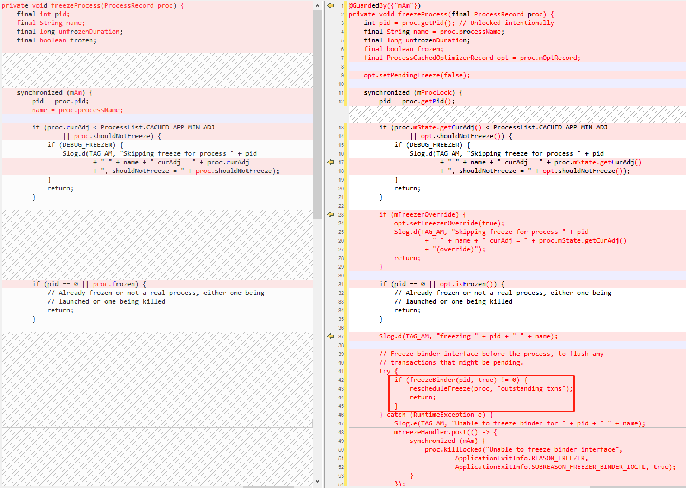
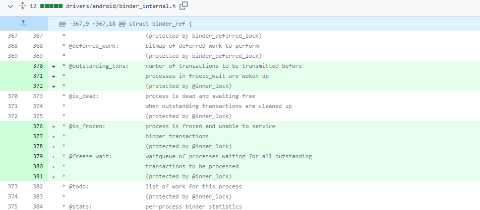
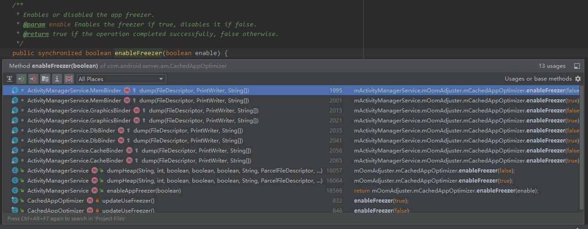

# Android13冻结进程分析：如何提高设备性能和用户体验

>本文介绍了Android13中的冻结进程功能，它是一种重要的资源管理策略，可以提高系统性能和稳定性，同时最大限度地节省设备的资源和电池消耗。
文章讨论了如何合理分配资源，包括CPU、内存等，以提高设备性能和用户体验。此外，文章还提到了冻结进程对应用程序线程的影响，并介绍了Android13与Android11的不同之处。

目前，Google 原生系统在 Android 11 或更高版本上支持 CACHE 应用的 CPU 冻结功能。当应用切换到后台并且没有其他活动时，系统会在一定时间内通过状态判断，将进程 ID 迁移到冻结的 cgroup 节点上，实现冻结 CACHE 应用。这项功能可以减少活跃缓存应用在后台存在时所消耗的 CPU 资源，从而达到节电的目的。当应用再次切换到前台时，系统会将该应用的进程解冻，以实现快速启动。

Google 在这方面的开发进展相对缓慢，从 Android 11 到现在的 Android 13，该功能基本上还只是个雏形。然而，在国内厂商方面，早就已经开始开发了类似功能，利用 CPU 调频、降速、冻结等基础功能，许多厂商在 Android 6.0 及以上版本已经支持了这些功能。
CPU 冻结对于手持设备而言可以提升整机性能。由于电量和 CPU 资源都是有限的，必须合理地分配资源，以便让用户在使用设备时获得更好的体验。

>基于 [SourceCodeTrace](https://source.toscl.com/zh-hans/) 项目推崇的原则，本文代码块引用均有来源，SourceCodeTrace Project 帮助您在博客、文章记录的过程中，引入对应项目以及版本，行号等信息，让后续的读者，通过引用来源，能够进行更加深入的学习，在博客或文章中引入代码块时，尽量提供代码的来源信息。

## 冻结进程的作用
1. 进程的执行被暂停：冻结的进程会被暂停，其所有线程的执行将被停止，包括应用程序的主线程以及任何后台线程。
2. 资源释放：冻结进程占用的资源，例如 CPU 和内存，会被释放。这些资源将被系统重新分配给其他需要执行的进程或系统服务。
3. 电池节省：冻结进程不会在后台运行，因此可以节省设备的电池消耗。对于后台的应用程序，冻结可以降低其电池使用量，延长设备的电池寿命。
4. 系统稳定性：通过冻结不活跃或低优先级的进程，可以避免它们竞争系统资源，从而提高系统的稳定性和响应能力。
5. 快速恢复：冻结的进程可以快速恢复其执行状态。当需要重新激活进程时，系统可以迅速将其恢复到之前的运行状态，而无需重新启动或加载应用程序。
冻结进程并不会终止进程的执行或销毁应用程序。冻结只是暂时挂起进程，以优化资源使用。一旦系统需要再次运行该进程（例如用户重新打开应用程序或系统需要其提供服务），它会被解冻并恢复运行。
冻结进程是 Android 系统中重要的资源管理策略之一，它有助于提高系统性能和稳定性，同时最大限度地节省设备的资源和电池消耗。

## 挂起进程的方式
CPU冻结是指将应用的进程挂起，不再分配CPU资源，以达到省电的目的，当应用再次切换到前台的时候，系统会将该应用的进程解冻，以达到快速启动的目的。

### 通过信号暂停进程
在Unix系统上也有一些任务控制信号(Job-Control-Signals)，比如我们经常查杀应用 使用 `kill -9` 其实就是发送一个 `SIGKILL=9` 的信号给进程，保证进程被干净的清理。 
通过发送 `SIGSTOP` 信号也能将进程状态切换为暂停(pause)，进程只有在收到 `SIGCONT` 信号时才会恢复执行。
但这个两个信号存在一个问题，`SIGCONT` 信号可以被执行的进程监听捕获到，并用来做进程自有的逻辑，导致任务的暂停和恢复变得不可控。
```bash
echo $$ # 查看当前进程ID
16644
bash # 在 1664 进程里面 Fork 一个子进程 bash
echo $$ # 查看当前进程ID
16690 # 子进程ID

# 在另一个终端上发送信号。
kill -SIGSTOP 16690 # 发送信号任务给进程ID16690暂停
kill -SIGCONT 16690 # 发送信号任务给进程ID16690恢复

# 这样操作发送信号任务给进程ID16690退出，导致父进程 16644也同样被退出。
```
[cgroup-v1/freezer-subsystem.txt](https://www.kernel.org/doc/Documentation/cgroup-v1/freezer-subsystem.txt)

信号这块其实有很多使用场景，比如分析应用卡顿和性能相关问题时，我们有时候需要主动触发应用来输出堆栈，便于我们深入分析问题。
即通过 `kill -3 {进程id}` 来实现，停止进程并触发进程指定的信号处理函数创建`核心转储文件(dump file)`，后续会再分析。

### 通过cgroup freezer子系统
为了防止进程能够捕获到信号，然后对冻结行为进行干扰，比如应用保活行为里面常见的双进程互拉就是通过两个进程相互监听来实现保活的。

通过 cgroup 的 freezer子系统功能 就能在进程无感知的情况下，将进程冻结。 

在Android11之前，大部分的厂商也是通过移植cgroup的freezer来实现的，freezer是Linux内核中用于控制和限制进程组的一种特性，它可以对进程组进行资源控制，包括CPU、内存、IO等。
freezer cgroup 通过将进程的状态设置为 FROZEN 来实现冻结，这样进程就不会再被调度，也不会再消耗CPU资源，直到进程的状态被设置为 THAWED 为止。


## 开发者模式下开启应用冻结
```
adb shell device_config put activity_manager_native_boot use_freezer true && adb reboot
```

## 检查测试应用是否被冻结
被冻结的应用会被分配到对应的 cgroup 组，不同设备的节点文件也不一致，根据设备实际操作：

- 比如检查 `/dev/freezer/frozen/cgroup.procs` 中的进程ID列表，如下是我常用的命令：
```bash
adb shell cat /dev/freezer/frozen/cgroup.procs | grep -E "[0-9]{4}" | xargs adb shell ps -A | grep "com"
```

- 检查是否存在 `/sys/fs/cgroup/uid_0/cgroup.freeze` 文件。
```bash
adb shell cat /sys/fs/cgroup/uid_{应用UID}/cgroup.freeze
```

- 查看日志（一般日志会有相应含义的字符，各家厂商也不一样，这里是个例子）
```bash
adb logcat | grep -i "\(freezing\|froze\)"
```

## 进程状态
### 标准状态
下面这个图表，是一个标准的进程状态的定义:

| 标号 | 中文名      | 英文名                    | 解释                                                   |
|----|----------|------------------------|------------------------------------------------------|
| D  | 不可中断的睡眠态 | UNINTERRUPTIBLE  SLEEP | 进程正在跟硬件交互，并且交互过程不允许被其他进程或中断打断。通常出现在I/O阻塞             |
| R  | 运行态      | RUNNING OR  RUNNABLE   | 表示进程在 CPU 的就绪队列中，正在运行或者正在等待运行。                       |
| S  | 可中断的睡眠态  | INTERRUPTIBLE  SLEEP   | 进程因为等待某个事件而被系统挂起。当进程等待的事件发生时，它会被唤醒并进入 R 状态。          |
| T  | 被跟踪或已停止  | STOOPED                | 表示进程处于暂停或者跟踪状态（命令行调试）                                |
| Z  | 僵尸态      | ZOMBIE                 | 进程实际上已经结束了，但是父进程还没有回收它的资源（比如进程的描述符、PID 等）。           |
| I  | 空闲状态     | IDLE                   | 也就是空闲状态，用在不可中断睡眠的内核线程上。D 状态的进程会导致平均负载升高， I 状态的进程却不会。 |
| X  | 死亡状态     | DEAD                   | 用TOP、PS命令获取不到                                        |

下述这段代码是引用特斯拉开源的Linux源码，也是符合定义的标准的。

```cpp
/*
* The task state array is a strange "bitmap" of
* reasons to sleep. Thus "running" is zero, and
* you can test for combinations of others with
* simple bit tests.
  */
  static const char * const task_state_array[] = {
  "R (running)",		/*   0 */
  "S (sleeping)",		/*   1 */
  "D (disk sleep)",	/*   2 */
  "T (stopped)",		/*   4 */
  "t (tracing stop)",	/*   8 */
  "X (dead)",		/*  16 */
  "Z (zombie)",		/*  32 */
  };
```
[s/proc/array.c#L116-L124](https://github.com/teslamotors/linux/blob/f1fb5b640056e29852f3d9345ac0a381e04cedbe/fs/proc/array.c#L116-L124)

### CPU冻结后的进程状态
如果应用处于被冻结的状态，我们可以通过 `adb shell ps -A` 命令来查看进程的状态，如果进程的状态是 D 状态，那么就说明进程被冻结了。

>对于一些做内核反调试的设备，有的也会来改这种状态，比如将进程的状态改成 X 状态，这样就能够防止被调试器 attach 到进程上, 将所有进程状态 t 改成 S状态，让应用无法捕获到进程被调试，这块也是可以展开讨论的地方。

在手机设备中，当一个应用长期在后台并且使用不频繁，比如 `com.tencent.wework` 符合冻结条件后，进程的状态从 S 状态变成 D 状态，这个时候进程就会被冻结，不会再被调度，也不会再消耗CPU资源，直到进程的状态被设置为 THAWED 为止。

比如在内核版本 4.14（Linux localhost 4.14.186 #1 SMP PREEMPT Wed Apr 26 09:09:04 UTC 2023 aarch64）中，被冻结的应用显示为 `D` 状态。
```bash
adb shell ps -A | grep "D "
#USER            PID   PPID     VSZ    RSS WCHAN            ADDR S NAME
#system          646      1 11640900 44436 0                   0 D surfaceflinger
#root           1263      2       0      0 0                   0 D [kworker/u16:15]
#root           6635      2       0      0 0                   0 D [kworker/u16:5]
#u0_a193       15586    540 15865212 177720 0                  0 D com.tencent.wework
```

在不同版本上，随着CPU的冻结这块功能的不断迭代，在高版本中已经不会对进程切到 D 状态，而是保留 S 态，然后在 S 态的基础上做 freeze 的处理。
比如常见的是，在进程被冻结之后，进程还是处于 `S` 态，但是会在内核函数 `_refrigerator` 或者 `do_freezer_trap` 上等待。 

比如在内核版本 `5.4 （Linux localhost 5.4.210 #4 SMP PREEMPT Tue Jul 11 03:50:44 UTC 2023 aarch64 Toybox ）` 中，`D` 状态以及不显示了，会在 `WCHAN` 中显示 `do_freezer_trap`.
```markdown
root           108     2       0      0 ion_heap_deferred_free 0 S [ion_system_heap]
root           300     2       0      0 ion_heap_deferred_free 0 S [carveout_oemcry]
root           301     2       0      0 ion_heap_deferred_free 0 S [carveout_fd]
u0_a131       3915   683 15570584 164928 do_freezer_trap    0 S com.kuangxiangciweimao.novel
u0_a132       3951   683 15276424 100604 do_freezer_trap    0 S com.dianshijia.tvlive
u0_a125       4279   684 2124872 262268 do_freezer_trap     0 S com.fenqile.fenqile
u0_a123       4780   683 15050296 185368 do_freezer_trap    0 S com.qihoo.loan
u0_a130       5089   683 34064940 278784 do_freezer_trap    0 S com.edu24ol.newclass
u0_a130       5190   683 15091696 124916 do_freezer_trap    0 S com.edu24ol.newclass:configService
u0_a130       5263   683 15171540 131684 do_freezer_trap    0 S com.edu24ol.newclass:pushservice
u0_a130       5317   683 15519316 117572 do_freezer_trap    0 S com.edu24ol.newclass:core
u0_a126       5506   683 15589072 241948 do_freezer_trap    0 S cn.com.gjzq.yjb2
u0_a127       5587   684 1986720 121372 do_freezer_trap     0 S me.ele.crowdsource
```

::: tip
WCHAN 表示当前线程在内核上正在执行的函数名  
```bash
wchan      WCHAN     name of the kernel function in which the process
                     is sleeping, a "-" if the process is running, or
                     a "*" if the process is multi-threaded and ps is
                     not displaying threads.
```
:::

## 冻结的流程

### Android13 的变更
函数 `freezeProcess` 是最终调用， 冻结的流程，为了详细了解这两年版本的变化，这里直接对比 Android 11的冻结逻辑，然后和 Android 13 最新的冻结逻辑做一个比对。
Android 11 和 13 的变化如下图，左边是11 右边是13：


Android11上通过直接调用`Process.setProcessFrozen`来冻结进程，而 在Android 13上通过 `ActivityManagerService` 拿到进程更多的信息来做细分的冻结，而不是之前版本上的直接调用API，
通过 `@GuardedBy({"mAm"})` 注释指明了这个函数在被调用时需要持有mAm对象的锁， 确保在多线程环境下访问freezeProcess函数的安全性。
Android 13 针对binder 调用进行了优化，对进程的 binder 先进行冻结 `freezeBinder`，在此之前，如果随意的冻结应用，会导致一些应用后台的跨进程行为异常。

Google 最近几年逐步将 cgroup 上的功能，在上层做了一层封装，这样就可以通过上层的调用来实现CPU、内存资源的控制。
CPU冻结这一块，上层主要封装在是通 `Process.java`类的两个 native 函数中， 如下是这块主要的两个函数：
```java {1097-1119} {1106,1119} (https://gitee.com/cl10/fwkdev/blob/ecf53aa9439bc30eb00374d7e83b013ba36094b9//dev/src/frameworks/base/core/java/android/os/Process.java?#L1097-L1119)
    /**
     * Freeze or unfreeze the specified process.
     *
     * @param pid Identifier of the process to freeze or unfreeze.
     * @param uid Identifier of the user the process is running under.
     * @param frozen Specify whether to free (true) or unfreeze (false).
     *
     * @hide
     */
    public static final native void setProcessFrozen(int pid, int uid, boolean frozen);

    /**
     * Enable or disable the freezer. When enable == false all frozen processes are unfrozen,
     * but aren't removed from the freezer. While in this state, processes can be added or removed
     * by using setProcessFrozen, but they won't actually be frozen until the freezer is enabled
     * again. If enable == true the freezer is enabled again, and all processes
     * in the freezer (including the ones added while the freezer was disabled) are frozen.
     *
     * @param enable Specify whether to enable (true) or disable (false) the freezer.
     *
     * @hide
     */
    public static final native void enableFreezer(boolean enable);
```
[/dev/src/frameworks/base/core/java/android/os/Process.java?#L1097-L1119](https://gitee.com/cl10/fwkdev/blob/ecf53aa9439bc30eb00374d7e83b013ba36094b9//dev/src/frameworks/base/core/java/android/os/Process.java?#L1097-L1119)

setProcessFrozen, 这个函数是针对单个进程的冻结。
enableFreezer(Android 13 已经废弃）, 针对所有应用的解冻，之前的实现是将整个freezer 功能开关控制，在 Android13 上 `enableFreezer` 方法放在了 `CachedAppOptimizer` 类中，上层通过 `AM` 实现读取应用状态批量处理进程。


### Native函数 setProcessFrozen
下面以 native 函数 `setProcessFrozen` 介绍冻结的流程， 因为 Android 系统所规划的路线，我的理解是尽量将内核上的变化，然后规整到 AOSP 的架构里面，上层通过简单的接口调用，实现对整个设备资源进行划分。
通过简单的配置一个 
```cpp {282-296} {288} (https://github.com/10cl/fwkdev/blob/bfdf83c54ee15fdd53e2ed1f69e6f6f3f1cc1fbb//dev/src/frameworks/base/core/jni/android_util_Process.cpp?#L282-L296)
void android_os_Process_setProcessFrozen(
        JNIEnv *env, jobject clazz, jint pid, jint uid, jboolean freeze)
{
    bool success = true;

    if (freeze) {
        success = SetProcessProfiles(uid, pid, {"Frozen"});
    } else {
        success = SetProcessProfiles(uid, pid, {"Unfrozen"});
    }

    if (!success) {
        signalExceptionForGroupError(env, EINVAL, pid);
    }
}
```
[/dev/src/frameworks/base/core/jni/android_util_Process.cpp?#L282-L296](https://github.com/10cl/fwkdev/blob/bfdf83c54ee15fdd53e2ed1f69e6f6f3f1cc1fbb//dev/src/frameworks/base/core/jni/android_util_Process.cpp?#L282-L296)

### cgroup 抽象层
Android 10 及更高版本将对照组 (cgroup) 抽象层和任务配置文件搭配使用，让开发者能够使用它们来描述应用于某个线程或进程的一组（或多组）限制。
然后，系统按照任务配置文件的规定操作来选择一个或多个适当的 cgroup；
通过这种方式，系统可以应用各种限制，并对底层 cgroup 功能集进行更改，而不会影响较高的软件层。 
>cgroup 提供一种机制，可将任务集（包括进程、线程及其所有未来的子级）聚合并分区到具有专门行为的层级组中。Android 使用 cgroup 控制及考量 CPU 和内存等系统资源的使用和分配情况，并支持 Linux 内核 cgroup v1 和 cgroup v2。


libprocessgroup 中的 `SetProcessProfiles` 函数，这个函数是通过 `TaskProfiles` 类来实现的，这个类主要是通过 `TaskProfiles::GetInstance()` 来获取单例对象，然后调用 `SetProcessProfiles` 函数来实现进程的冻结。

通过传输三个参数 **UID, PID, "Frozen" or "Unfrozen"**，来实现进程的冻结和解冻。


下面通过 `SetProcessProfiles` 函数来介绍冻结的流程，通过传输下去的 "Frozen" 字符如何最终写入到 cgroup 中。


```cpp {150-152} {151} (https://github.com/10cl/fwkdev/blob/bfdf83c54ee15fdd53e2ed1f69e6f6f3f1cc1fbb//dev/src/system/core/libprocessgroup/processgroup.cpp?#L150-L152)
bool SetProcessProfiles(uid_t uid, pid_t pid, const std::vector<std::string>& profiles) {
    return TaskProfiles::GetInstance().SetProcessProfiles(uid, pid, profiles, false);
}
```
[/dev/src/system/core/libprocessgroup/processgroup.cpp?#L150-L152](https://github.com/10cl/fwkdev/blob/bfdf83c54ee15fdd53e2ed1f69e6f6f3f1cc1fbb//dev/src/system/core/libprocessgroup/processgroup.cpp?#L150-L152)

TaskProfiles 类中的 `SetProcessProfiles` 函数，这个函数主要是通过 `TaskProfile` 类来实现的，
这个类主要是通过 `TaskProfile::EnableResourceCaching` 函数读取配置文件，通过 `TaskProfile::ExecuteForProcess` 函数来实现进程的冻结。
```cpp {807-826} {816} (https://github.com/10cl/fwkdev/blob/bfdf83c54ee15fdd53e2ed1f69e6f6f3f1cc1fbb//dev/src/system/core/libprocessgroup/task_profiles.cpp?#L807-L826)
bool TaskProfiles::SetProcessProfiles(uid_t uid, pid_t pid,
                                      const std::vector<std::string>& profiles, bool use_fd_cache) {
    bool success = true;
    for (const auto& name : profiles) {
        TaskProfile* profile = GetProfile(name);
        if (profile != nullptr) {
            if (use_fd_cache) {
                profile->EnableResourceCaching(ProfileAction::RCT_PROCESS);
            }
            if (!profile->ExecuteForProcess(uid, pid)) {
                PLOG(WARNING) << "Failed to apply " << name << " process profile";
                success = false;
            }
        } else {
            PLOG(WARNING) << "Failed to find " << name << " process profile";
            success = false;
        }
    }
    return success;
}
```
[/dev/src/system/core/libprocessgroup/task_profiles.cpp?#L807-L826](https://github.com/10cl/fwkdev/blob/bfdf83c54ee15fdd53e2ed1f69e6f6f3f1cc1fbb//dev/src/system/core/libprocessgroup/task_profiles.cpp?#L807-L826)

对于新的架构之下，`TaskProfile` 类中的 `EnableResourceCaching` 函数，这个函数主要是通过 `FdCacheHelper` 类来实现的，这个类主要是通过 `FdCacheHelper::Cache` 函数来实现进程的冻结, 这里主要是对文件做一个缓存，这里文件这块的流程就不深入分解了。


```cpp {339-358} {352} (https://github.com/10cl/fwkdev/blob/bfdf83c54ee15fdd53e2ed1f69e6f6f3f1cc1fbb//dev/src/system/core/libprocessgroup/task_profiles.cpp?#L339-L358)
void SetCgroupAction::EnableResourceCaching(ResourceCacheType cache_type) {
    std::lock_guard<std::mutex> lock(fd_mutex_);
    // Return early to prevent unnecessary calls to controller_.Get{Tasks|Procs}FilePath() which
    // include regex evaluations
    if (fd_[cache_type] != FdCacheHelper::FDS_NOT_CACHED) {
        return;
    }
    switch (cache_type) {
        case (ProfileAction::RCT_TASK):
            FdCacheHelper::Cache(controller_.GetTasksFilePath(path_), fd_[cache_type]);
            break;
        case (ProfileAction::RCT_PROCESS):
            // uid and pid don't matter because IsAppDependentPath ensures the path doesn't use them
            FdCacheHelper::Cache(controller_.GetProcsFilePath(path_, 0, 0), fd_[cache_type]);
            break;
        default:
            LOG(ERROR) << "Invalid cache type is specified!";
            break;
    }
}
```
[/dev/src/system/core/libprocessgroup/task_profiles.cpp?#L339-L358](https://github.com/10cl/fwkdev/blob/bfdf83c54ee15fdd53e2ed1f69e6f6f3f1cc1fbb//dev/src/system/core/libprocessgroup/task_profiles.cpp?#L339-L358)


#### task_profiles.json
`task_profiles.json` 文件位于 `<ANDROID_BUILD_TOP>/system/core/libprocessgroup/profiles/` 下。
该文件用于描述要应用于进程或线程的一组特定操作。这组操作与一个配置文件名称相关联，后者在 `SetTaskProfiles` 和 `SetProcessProfiles` 调用中用于调用配置文件操作。

- Attributes
  - Name 字段 - 指定 Attribute 的名称。
  - Controller 字段 - 按名称引用 cgroups.json 文件中的 cgroup 控制器(目前已有的控制器包含 `cpuset` `memory` `cpu` `blkio` 等，这些也可以新增自定义)
  - File 字段 - 为相应控制器下的特定文件命名。

`task_profiles.json` 文件中，在 `Attributes` 属性下， 对应冻结的属性为："FreezerState"，对应的控制器为`freezer`，然后最终写的节点为 `cgroup.freeze`.
```json {75-79} {76} (https://github.com/10cl/fwkdev/blob/bfdf83c54ee15fdd53e2ed1f69e6f6f3f1cc1fbb//dev/src/system/core/libprocessgroup/profiles/task_profiles.json?#L75-L79)
    {
      "Name": "FreezerState",
      "Controller": "freezer",
      "File": "cgroup.freeze"
    }
```
[/dev/src/system/core/libprocessgroup/profiles/task_profiles.json?#L75-L79](https://github.com/10cl/fwkdev/blob/bfdf83c54ee15fdd53e2ed1f69e6f6f3f1cc1fbb//dev/src/system/core/libprocessgroup/profiles/task_profiles.json?#L75-L79)

**"Frozen"** 关键词最终定义的地方在:
```json {96-121} {97} (https://github.com/10cl/fwkdev/blob/bfdf83c54ee15fdd53e2ed1f69e6f6f3f1cc1fbb//dev/src/system/core/libprocessgroup/profiles/task_profiles.json?#L96-L121)
    {
      "Name": "Frozen",
      "Actions": [
        {
          "Name": "SetAttribute",
          "Params":
          {
            "Name": "FreezerState",
            "Value": "1"
          }
        }
      ]
    },
    {
      "Name": "Unfrozen",
      "Actions": [
        {
          "Name": "SetAttribute",
          "Params":
          {
            "Name": "FreezerState",
            "Value": "0"
          }
        }
      ]
    },
```
[/dev/src/system/core/libprocessgroup/profiles/task_profiles.json?#L96-L121](https://github.com/10cl/fwkdev/blob/bfdf83c54ee15fdd53e2ed1f69e6f6f3f1cc1fbb//dev/src/system/core/libprocessgroup/profiles/task_profiles.json?#L96-L121)

### cgroup 节点
如上通过配置的最终状态，实现对 cgroup 文件节点的控制。
最终体现到的节点状态如下：
```bash
    0 12806   0 I<     39  fg [kworker/4:0H]              kworker/4:0H    worker_thread
10135 12821   0 S      19  bg com.duowan.kiwi             com.duowan.kiwi do_freezer_trap
    0 12869   0 I<     39  fg [kbase_event]               kbase_event     rescuer_thread
```

通过UID 找到对应的cgroup:
```bash
λ adb shell ls /sys/fs/cgroup/uid_10135
cgroup.controllers  cgroup.max.descendants  cgroup.threads  io.pressure
cgroup.events       cgroup.procs            cgroup.type     memory.pressure
cgroup.freeze       cgroup.stat             cpu.pressure    pid_12821
cgroup.max.depth    cgroup.subtree_control  cpu.stat
```

## 冻结跨进程行为
在Android中，跨进程交互是指不同进程之间进行通信和数据交换的方式。Android提供了多种方法来实现跨进程交互，以下是其中一些常见的方法：
1. Binder：Binder是Android中最常用的跨进程通信（IPC）机制。它是一种高效的客户端-服务器架构，由底层Linux内核提供支持。通过Binder，一个进程可以注册一个服务，并暴露接口供其他进程调用。其他进程可以通过Binder代理来调用服务的接口，从而实现进程间通信。
2. AIDL（Android Interface Definition Language）：AIDL是Android Interface Definition Language的缩写。它是一种用于定义进程间接口的IDL语言。AIDL可以帮助开发人员定义接口，并生成对应的Java类和Binder代理，使得跨进程调用变得更加简单。
3. ContentProvider：ContentProvider是一种Android提供的数据共享机制，用于在不同应用程序之间共享数据。其他应用程序可以通过ContentResolver来访问和修改ContentProvider中的数据，从而实现跨进程数据共享。
4. Messenger：Messenger是一种基于Binder的轻量级通信机制。它允许在不同进程之间传递简单的Message对象，实现进程间通信。
5. BroadcastReceiver：BroadcastReceiver是一种用于接收广播消息的组件。通过发送广播消息，不同进程之间可以实现简单的通信。
6. Intent：Intent是用于在不同组件之间传递消息和数据的对象。通过Intent，可以在不同进程之间启动组件、传递数据和执行特定操作。
7. Socket：Socket是一种基于网络的跨进程通信方式。通过Socket，不同进程可以建立TCP或UDP连接，进行数据交换和通信。
8. Messenger和AIDL的结合：有时候在应用中既需要支持跨进程的异步通信，又需要传输复杂的数据结构。这时可以将Messenger和AIDL结合使用，通过AIDL定义复杂数据结构的接口，然后通过Messenger来传递带有这些数据结构的Message对象。
不同的跨进程交互方法适用于不同的场景和需求，模块的开发可能选择不同的方式实现进程间通信，冻结进程如果发生在跨进程的交互行为上，那就可能导致进程间通信的阻塞，从而导致ANR。

### ContentProvider 交互异常
如果是常规的一个异步的调用，没有强绑定，不会让调用阻塞，这样的调用不会有什么问题，但是如果是一个同步调用，比如进程 A 调用进程 B 的 ContentProvider接口，进程 B 被冻结了，这个时候进程 A 就会被挂起等待，如果没有处理这种场景，就会有如下类似的 trace:
```java {15}
"main" prio=5 tid=1 Native
  | group="main" sCount=1 dsCount=0 flags=1 obj=0x7209f5f8 self=0xb40000701e2cd010
  | sysTid=7766 nice=-10 cgrp=default sched=0/0 handle=0x71451a54f8
  | state=S schedstat=( 2529213544 46180857 3336 ) utm=208 stm=44 core=6 HZ=100
  | stack=0x7fdff81000-0x7fdff83000 stackSize=8192KB
  | held mutexes=
  native: #00 pc 000000000009a9d4  /apex/com.android.runtime/lib64/bionic/libc.so (__ioctl+4)
  native: #01 pc 0000000000057ac4  /apex/com.android.runtime/lib64/bionic/libc.so (ioctl+160)
  native: #02 pc 00000000000519d4  /system/lib64/libbinder.so (android::IPCThreadState::talkWithDriver(bool)+296)
  native: #03 pc 0000000000052a08  /system/lib64/libbinder.so (android::IPCThreadState::waitForResponse(android::Parcel*, int*)+128)
  native: #04 pc 0000000000052734  /system/lib64/libbinder.so (android::IPCThreadState::transact(int, unsigned int, android::Parcel const&, android::Parcel*, unsigned int)+184)
  native: #05 pc 000000000004b00c  /system/lib64/libbinder.so (android::BpBinder::transact(unsigned int, android::Parcel const&, android::Parcel*, unsigned int)+152)
  native: #06 pc 0000000000123d44  /system/lib64/libandroid_runtime.so (android_os_BinderProxy_transact(_JNIEnv*, _jobject*, int, _jobject*, _jobject*, int)+152)
  at android.os.BinderProxy.transactNative(Native method)
  at android.os.BinderProxy.transact(BinderProxy.java:540)
  at android.content.ContentProviderProxy.query(ContentProviderNative.java:470)
  at android.content.ContentResolver.query(ContentResolver.java:1183)
  at android.content.ContentResolver.query(ContentResolver.java:1115)
  at android.content.ContentResolver.query(ContentResolver.java:1071)
  at com.tencent.open.utils.h.c(ProGuard:5)
  at com.tencent.open.utils.h.b(ProGuard:1)
  at com.tencent.open.utils.h.a(ProGuard:2)
  at com.tencent.open.utils.k.a(ProGuard:3)
  at com.tencent.open.utils.k.c(ProGuard:1)
  at com.tencent.tauth.Tencent.isSupportSSOLogin(ProGuard:5)
  at com.umeng.socialize.handler.UMQQSsoHandler.isInstall(UMQQSsoHandler.java:1)
  at com.umeng.socialize.a.a.a(SocialRouter.java:34)
  at com.umeng.socialize.UMShareAPI.isInstall(UMShareAPI.java:2)
  at com.toscl.*.ui.common.switchplay.SwitchVideo.initViewAndListener(SwitchVideo.java:3)
  at com.toscl.*.ui.common.switchplay.SwitchVideo.init(SwitchVideo.java:3)
```

### onServiceConnected 交互异常
在比如下述的 ANR 阻塞在 onServiceConnected， Service 绑定传输信息但是对方进程被冻结导致的ANR。
```java {17}
"main" prio=5 tid=1 Native
  | group="main" sCount=1 dsCount=0 flags=1 obj=0x72c702e0 self=0xdf185410
  | sysTid=8513 nice=-10 cgrp=default sched=0/0 handle=0xecb40470
  | state=S schedstat=( 3322230460 257625780 4174 ) utm=294 stm=37 core=4 HZ=100
  | stack=0xff5c4000-0xff5c6000 stackSize=8192KB
  | held mutexes=
  native: #00 pc 00070ac0  /apex/com.android.runtime/lib/bionic/libc.so (__ioctl+8)
  native: #01 pc 0003f02f  /apex/com.android.runtime/lib/bionic/libc.so (ioctl+26)
  native: #02 pc 00039a13  /system/lib/libbinder.so (android::IPCThreadState::talkWithDriver(bool)+238)
  native: #03 pc 0003a635  /system/lib/libbinder.so (android::IPCThreadState::waitForResponse(android::Parcel*, int*)+32)
  native: #04 pc 0003a40f  /system/lib/libbinder.so (android::IPCThreadState::transact(int, unsigned int, android::Parcel const&, android::Parcel*, unsigned int)+122)
  native: #05 pc 00035267  /system/lib/libbinder.so (android::BpBinder::transact(unsigned int, android::Parcel const&, android::Parcel*, unsigned int)+98)
  native: #06 pc 000c6ae3  /system/lib/libandroid_runtime.so (android_os_BinderProxy_transact(_JNIEnv*, _jobject*, int, _jobject*, _jobject*, int)+82)
  at android.os.BinderProxy.transactNative(Native method)
  at android.os.BinderProxy.transact(BinderProxy.java:540)
  at com.jht.engine.platsign.IKypcService$Stub$Proxy.registerListener(IKypcService.java:266)
  at com.*.*.util.AiSingSound$1.onServiceConnected(AiSingSound.java:52)
  - locked <0x03d7b64e> (a com.*.*.util.AiSingSound$1)
  at android.app.LoadedApk$ServiceDispatcher.doConnected(LoadedApk.java:1983)
  at android.app.LoadedApk$ServiceDispatcher$RunConnection.run(LoadedApk.java:2015)
  at android.os.Handler.handleCallback(Handler.java:938)
  at android.os.Handler.dispatchMessage(Handler.java:99)
  at android.os.Looper.loop(Looper.java:223)
  at android.app.ActivityThread.main(ActivityThread.java:7745)
  at java.lang.reflect.Method.invoke(Native method)
  at com.android.internal.os.RuntimeInit$MethodAndArgsCaller.run(RuntimeInit.java:612)
  at com.android.internal.os.ZygoteInit.main(ZygoteInit.java:1009)
```
这种例子很多，从应用开发的角度而言，如果了解更多的Linux的状态，这样才能更好的定位问题。

对于系统开发，需要找出这些问题的根源，从而解决问题， 比如跨进程会有哪些行为，跨进程的行为状态，通用的特征，比如不管是 ContentProvider 还是 Service 的绑定，都是通过 binder 来实现跨进程传输。
如果通过 binder 直接处理好是不是能解决好问题，在Android 11 之前，内核版本上，binder 驱动还没有直接 FREEZER 状态，
到了 Android 13 之后，binder 驱动已经支持 FREEZER 状态，当应用调用一个被 冻结 binder 进程后，会直接返回一个错误， 这就不会阻塞调用方的进程。

## 新的API BINDER_FREEZE
相比Android 11， Android 13上会首先会冻结与进程关联的Binder接口，以刷新可能在排队中的Binder事务，如果有 binder 的事务需要处理，将会重新延时（默认10分钟）在执行冻结进程逻辑。
如果在冻结 binder 接口过程中异常就会直接将应用查杀。
如果冻结成功，就会继续执行冻结进程的逻辑，因此不会阻塞 binder 调用方的进程，这样就不会出现上述的 ANR 问题。

```java {1705-1733} {1708,1726} (https://github.com/10cl/fwkdev/blob/bfdf83c54ee15fdd53e2ed1f69e6f6f3f1cc1fbb//dev/src/frameworks/base/services/core/java/com/android/server/am/CachedAppOptimizer.java?#L1705-L1733)
                // Freeze binder interface before the process, to flush any
                // transactions that might be pending.
                try {
                    if (freezeBinder(pid, true) != 0) {
                        rescheduleFreeze(proc, "outstanding txns"); // outstanding_txns 表示是否有需要处理的事务，在下面内核的函数分析中会有涉及。
                        return;
                    }
                } catch (RuntimeException e) {
                    Slog.e(TAG_AM, "Unable to freeze binder for " + pid + " " + name);
                    mFreezeHandler.post(() -> {
                        synchronized (mAm) {
                            proc.killLocked("Unable to freeze binder interface",
                                    ApplicationExitInfo.REASON_FREEZER,
                                    ApplicationExitInfo.SUBREASON_FREEZER_BINDER_IOCTL, true);
                        }
                    });
                }

                long unfreezeTime = opt.getFreezeUnfreezeTime();

                try {
                    Process.setProcessFrozen(pid, proc.uid, true);

                    opt.setFreezeUnfreezeTime(SystemClock.uptimeMillis());
                    opt.setFrozen(true);
                    mFrozenProcesses.put(pid, proc);
                } catch (Exception e) {
                    Slog.w(TAG_AM, "Unable to freeze " + pid + " " + name);
                }
```
[/dev/src/frameworks/base/services/core/java/com/android/server/am/CachedAppOptimizer.java?#L1705-L1733](https://github.com/10cl/fwkdev/blob/bfdf83c54ee15fdd53e2ed1f69e6f6f3f1cc1fbb//dev/src/frameworks/base/services/core/java/com/android/server/am/CachedAppOptimizer.java?#L1705-L1733)

`freezeBinder` 是一个 native 函数，这个函数会调用 Framework上兼容 BINDER_FREEZE 的接口上。

```java {739-753} {753} (https://github.com/10cl/fwkdev/blob/bfdf83c54ee15fdd53e2ed1f69e6f6f3f1cc1fbb//dev/src/frameworks/base/services/core/java/com/android/server/am/CachedAppOptimizer.java?#L739-L753)
    /**
     * Informs binder that a process is about to be frozen. If freezer is enabled on a process via
     * this method, this method will synchronously dispatch all pending transactions to the
     * specified pid. This method will not add significant latencies when unfreezing.
     * After freezing binder calls, binder will block all transaction to the frozen pid, and return
     * an error to the sending process.
     *
     * @param pid the target pid for which binder transactions are to be frozen
     * @param freeze specifies whether to flush transactions and then freeze (true) or unfreeze
     * binder for the specificed pid.
     *
     * @throws RuntimeException in case a flush/freeze operation could not complete successfully.
     * @return 0 if success, or -EAGAIN indicating there's pending transaction.
     */
    private static native int freezeBinder(int pid, boolean freeze);
```
[/dev/src/frameworks/base/services/core/java/com/android/server/am/CachedAppOptimizer.java?#L739-L753](https://github.com/10cl/fwkdev/blob/bfdf83c54ee15fdd53e2ed1f69e6f6f3f1cc1fbb//dev/src/frameworks/base/services/core/java/com/android/server/am/CachedAppOptimizer.java?#L739-L753)

### Framework兼容 BINDER_FREEZE api
Framework 通过 `IPCThreadState::freeze` 调用到 libbinder 内：

```cpp {475-485} {478} (https://github.com/10cl/fwkdev/blob/bfdf83c54ee15fdd53e2ed1f69e6f6f3f1cc1fbb//dev/src/frameworks/base/services/core/jni/com_android_server_am_CachedAppOptimizer.cpp?#L475-L485)
static jint com_android_server_am_CachedAppOptimizer_freezeBinder(
        JNIEnv *env, jobject clazz, jint pid, jboolean freeze) {

    jint retVal = IPCThreadState::freeze(pid, freeze, 100 /* timeout [ms] */);
    if (retVal != 0 && retVal != -EAGAIN) {
        jniThrowException(env, "java/lang/RuntimeException", "Unable to freeze/unfreeze binder");
    }

    return retVal;
}
```
[/dev/src/frameworks/base/services/core/jni/com_android_server_am_CachedAppOptimizer.cpp?#L475-L485](https://github.com/10cl/fwkdev/blob/bfdf83c54ee15fdd53e2ed1f69e6f6f3f1cc1fbb//dev/src/frameworks/base/services/core/jni/com_android_server_am_CachedAppOptimizer.cpp?#L475-L485)

这部分 native API 的设计，在2020年提交，用来解决上述的问题，调用方调用被冻结的进程后，会直接给返回异常 , 而不是持续的阻塞。

这个提交的内容如下：
::: tip
**binder: adopt BINDER_FREEZE api**

>binder: adopt BINDER_FREEZE api  
The BINDER_FREEZE ioctl and related structures have been added to the  
driver to notify binder of the frozen state of a process. This patch  
introduces low-level user space handling for libbinder.  
Bug: 143717177  
Test: verified that binder transactions to a frozen app return ERR_FROZEN  
Test: verified that transactions are correctly received by non-frozen apps  
Co-developed-by: Todd Kjos <tkjos@google.com>  
Change-Id: I31fed5ecb040f5ba5b8e27ab6a20c441964f32b4  
[binder: adopt BINDER_FREEZE api](https://android-review.googlesource.com/c/platform/frameworks/native/+/1421693)
:::

这是一个新增的 ioctl 用来，标记为 `BINDER_FREEZE` 用来操作 binder 的冻结功能。
>在计算机中，ioctl(input/output control)是一个专用于设备输入输出操作的系统调用,该调用传入一个跟设备有关的请求码，系统调用的功能完全取决于请求码。

```cpp {1425-1445} {1435} (https://github.com/10cl/fwkdev/blob/bfdf83c54ee15fdd53e2ed1f69e6f6f3f1cc1fbb//dev/src/frameworks/native/libs/binder/IPCThreadState.cpp?#L1425-L1445)
status_t IPCThreadState::freeze(pid_t pid, bool enable, uint32_t timeout_ms) {
    struct binder_freeze_info info;
    int ret = 0;

    info.pid = pid;
    info.enable = enable;
    info.timeout_ms = timeout_ms;


#if defined(__ANDROID__)
    if (ioctl(self()->mProcess->mDriverFD, BINDER_FREEZE, &info) < 0)
        ret = -errno;
#endif

    //
    // ret==-EAGAIN indicates that transactions have not drained.
    // Call again to poll for completion.
    //
    return ret;
}

```
[/dev/src/frameworks/native/libs/binder/IPCThreadState.cpp?#L1425-L1445](https://github.com/10cl/fwkdev/blob/bfdf83c54ee15fdd53e2ed1f69e6f6f3f1cc1fbb//dev/src/frameworks/native/libs/binder/IPCThreadState.cpp?#L1425-L1445)

最终这个 native api 通过 `ioctrl` 会走到内核 `binder` 的驱动上。

### 内核新增的 BINDER_FREEZE ioctl特性

::: tip
**binder: BINDER_FREEZE ioctl**

>binder: BINDER_FREEZE ioctl  
Frozen tasks can't process binder transactions, so a way is required to  
inform transmitting ends of communication failures due to the frozen  
state of their receiving counterparts. Additionally, races are possible  
between transitions to frozen state and binder transactions enqueued to  
a specific process.  
Implement BINDER_FREEZE ioctl for user space to inform the binder driver  
about the intention to freeze or unfreeze a process. When the ioctl is  
called, block the caller until any pending binder transactions toward  
the target process are flushed. Return an error to transactions to  
processes marked as frozen.  
[binder: BINDER_FREEZE ioctl  ](https://github.com/torvalds/linux/commit/432ff1e91694e4c55a5bf6bc0574f4c254970232)  

:::
#### 新增了三个字段


为了实现 binder 的冻结，内核上 binder 的结构体，新增了三个字段。
```h {414-419} {414,416,419} (https://github.com/torvalds/linux/blob/14f9643dc90adea074a0ffb7a17d337eafc6a5cc//drivers/android/binder_internal.h?#L414-L419)
	int outstanding_txns;
	bool is_dead;
	bool is_frozen;
	bool sync_recv;
	bool async_recv;
	wait_queue_head_t freeze_wait;
```
[/drivers/android/binder_internal.h?#L414-L419](https://github.com/torvalds/linux/blob/14f9643dc90adea074a0ffb7a17d337eafc6a5cc//drivers/android/binder_internal.h?#L414-L419)


#### 对调用方的进程冻结
这段代码是一个在 Linux 内核中的 binder 驱动的函数处理部分。这段代码中的函数处理了 BINDER_FREEZE 的 ioctl 请求。

```c {5439-5498} {5487,5454,5481,5488} (https://github.com/torvalds/linux/blob/14f9643dc90adea074a0ffb7a17d337eafc6a5cc//drivers/android/binder.c?#L5439-L5498)
	case BINDER_FREEZE: {
		struct binder_freeze_info info;
		struct binder_proc **target_procs = NULL, *target_proc;
		int target_procs_count = 0, i = 0;

		ret = 0;

		if (copy_from_user(&info, ubuf, sizeof(info))) {
			ret = -EFAULT;
			goto err;
		}

		mutex_lock(&binder_procs_lock); // 使用互斥锁 binder_procs_lock 锁住进程列表 binder_procs，以保护其遍历过程。
		hlist_for_each_entry(target_proc, &binder_procs, proc_node) { //  遍历 binder_procs 链表，对每个进程进行操作。
			if (target_proc->pid == info.pid)  // 如果当前遍历到的进程的 pid 等于传入的 info 结构体中的 pid，则 target_procs_count 增加 1，用于计数符合条件的进程数量。
				target_procs_count++;
		}

		if (target_procs_count == 0) { // 如果没有找到匹配的进程（target_procs_count == 0），则表示传入的 pid 无效，解锁互斥锁并返回 -EINVAL 错误。
			mutex_unlock(&binder_procs_lock);
			ret = -EINVAL;
			goto err;
		}

		target_procs = kcalloc(target_procs_count,
				       sizeof(struct binder_proc *),
				       GFP_KERNEL);  // 动态分配一个指向 struct binder_proc 指针数组的内存，并将其赋值给 target_procs，用于保存找到的匹配进程的指针。

		if (!target_procs) {
			mutex_unlock(&binder_procs_lock);
			ret = -ENOMEM;
			goto err;
		}

		hlist_for_each_entry(target_proc, &binder_procs, proc_node) { // 第二次遍历
			if (target_proc->pid != info.pid)
				continue;

			binder_inner_proc_lock(target_proc);
			target_proc->tmp_ref++;
			binder_inner_proc_unlock(target_proc);

			target_procs[i++] = target_proc; // 在第二次遍历中，找到匹配进程后，对该进程执行一系列操作：增加 tmp_ref 计数，将进程指针添加到 target_procs 数组中，并对 i 计数器进行递增。
		}
		mutex_unlock(&binder_procs_lock);

		for (i = 0; i < target_procs_count; i++) {
			if (ret >= 0)
				ret = binder_ioctl_freeze(&info,
							  target_procs[i]);  // 对 target_procs 数组中的每个进程执行 binder_ioctl_freeze 函数，并将函数的返回值保存在 ret 变量中。同时，对每个进程执行 binder_proc_dec_tmpref 函数，递减其 tmp_ref 计数。

			binder_proc_dec_tmpref(target_procs[i]);
		}

		kfree(target_procs);

		if (ret < 0)
			goto err;
		break;
	}
```
[/drivers/android/binder.c?#L5439-L5498](https://github.com/torvalds/linux/blob/14f9643dc90adea074a0ffb7a17d337eafc6a5cc//drivers/android/binder.c?#L5439-L5498)
以上的核心逻辑，是通过遍历进程，对所有 binder 请求 的target 是当前 pid的进程，进行一个批量的处理。

#### 更新 is_frozen 字段

```c {5232-5261} {5232,5254} (https://github.com/torvalds/linux/blob/14f9643dc90adea074a0ffb7a17d337eafc6a5cc//drivers/android/binder.c?#L5232-L5261)
static int binder_ioctl_freeze(struct binder_freeze_info *info,
			       struct binder_proc *target_proc)
{
	int ret = 0;

	if (!info->enable) { // 如果 info->enable 的值为 0（即禁用冻结），则将目标进程的 is_frozen 字段设置为 false，表示解冻该进程，并直接返回 0。
		binder_inner_proc_lock(target_proc);
		target_proc->sync_recv = false;
		target_proc->async_recv = false;
		target_proc->is_frozen = false;
		binder_inner_proc_unlock(target_proc);
		return 0;
	}

	/*
	 * Freezing the target. Prevent new transactions by
	 * setting frozen state. If timeout specified, wait
	 * for transactions to drain.
	 */
	binder_inner_proc_lock(target_proc);
	target_proc->sync_recv = false;
	target_proc->async_recv = false;
	target_proc->is_frozen = true; //  将目标进程的 is_frozen 字段设置为 true，表示冻结该进程。
	binder_inner_proc_unlock(target_proc);

	if (info->timeout_ms > 0) // 如果指定了超时时间，则等待直到该进程的所有事务（transactions）处理完成，或者等待超时。这里使用了 wait_event_interruptible_timeout 函数进行等待
		ret = wait_event_interruptible_timeout(
			target_proc->freeze_wait,
			(!target_proc->outstanding_txns),
			msecs_to_jiffies(info->timeout_ms));
```
[/drivers/android/binder.c?#L5232-L5261](https://github.com/torvalds/linux/blob/14f9643dc90adea074a0ffb7a17d337eafc6a5cc//drivers/android/binder.c?#L5232-L5261)

最终实现将 binder 结构体中的 `is_frozen` 字段设为 true， 后续的 binder 请求，将通过判断这个字段，实现给调用者返回冻结状态。

## 冻结的场景
进程冻结是整机性能优化中的关键技术之一，正确应用该技术可以显著提升整机性能。然而，不当使用会带来问题，如应用切换到前台时没有及时解冻可能出现卡顿，影响用户体验，因此在优化时需要慎重考虑。

在国内，应用数量众多，存在优先级和类别的差异。除主流应用外，其他应用占比较小。由于缺乏足够的政策监管，国内开发者采用多种技术手段相互竞争。因此，国内手机厂商针对冻结不仅局限于 CACHE APP，而是对所有应用进行状态模块的拆解。例如，应用在后台需要被冻结，但状态模块的判断会考虑一些特殊情况，如应用中使用桌面小组件、正在播放音频或涉及跨进程行为等。这样极致地使用 CPU 冻结，大幅提升系统性能。

在国内特定环境下，一些主要应用如微信和 QQ 通常被主流厂商直接加入白名单，避免被冻结。因此，国内手机厂商针对冻结场景做了许多优化。

确定何时冻结进程其实是一个复杂的问题，需要维护一个流程图来管理不同的场景。在本文中，我们只是简单介绍了原生的场景。后续我们将发布另一篇文章，专门讲解国内特定场景下的优化策略。

### ADJ 更新
在Android Framework中，`OomAdjuster` OOM资源管理是Android系统中重要的资源管理机制之一，它负责计算和调整进程的OOM（Out Of Memory）优先级。OOM优先级用于确定在系统内存不足时哪些进程会被杀死以释放内存资源。`OomAdjuster`考虑了进程的内存使用情况、可见性、重要性、运行状态和系统角色等因素，计算出每个进程的合适OOM优先级，并将其应用于系统的资源管理。

**adj（Adjustment）**：在Linux内核中，进程的优先级由`adj`值来表示，也称为进程优先级值。在Android系统中，OOM优先级通过`adj`值来实现。Android系统定义了一系列的`adj`值范围，代表不同的OOM优先级。例如，`adj`值为-17代表前台进程，`adj`值为0代表可见进程，`adj`值为6代表服务进程等。系统根据`OomAdjuster`计算出的OOM优先级来设置进程的`adj`值，从而确定进程在内存不足时被杀死的概率。

调整过程：`OomAdjuster`计算出进程的OOM优先级后，会将其映射到对应的`adj`值范围。然后，系统根据进程的`adj`值来决定哪些进程优先保留，哪些进程应该被终止以释放内存。`adj`值越小，表示进程优先级越高，越不容易被杀死。`OomAdjuster`的目的就是通过合理的计算和调整，使得系统能够更好地管理资源，提高系统性能和稳定性。

在 `OomAdjuster` 更新 adj 的时候，会调用 `updateAppFreezeStateLSP` 函数用来更新应用的冻结状态：
```java {3107-3131} {3125-3126} (https://github.com/10cl/fwkdev/blob/bfdf83c54ee15fdd53e2ed1f69e6f6f3f1cc1fbb//dev/src/frameworks/base/services/core/java/com/android/server/am/OomAdjuster.java?#L3107-L3131)
    private void updateAppFreezeStateLSP(ProcessRecord app, String oomAdjReason) {
        if (!mCachedAppOptimizer.useFreezer()) {   // 是否使用冻结机制
            return;
        }

        if (app.mOptRecord.isFreezeExempt()) { // 是否免冻结, 这里追溯过去的话，目前只有判断是否拥有安装器权限
            return;
        }

        final ProcessCachedOptimizerRecord opt = app.mOptRecord;
        // if an app is already frozen and shouldNotFreeze becomes true, immediately unfreeze
        if (opt.isFrozen() && opt.shouldNotFreeze()) {  // 是否已经冻结并且不应该冻结
            mCachedAppOptimizer.unfreezeAppLSP(app, oomAdjReason);
            return;
        }

        final ProcessStateRecord state = app.mState;
        // Use current adjustment when freezing, set adjustment when unfreezing.
        if (state.getCurAdj() >= ProcessList.CACHED_APP_MIN_ADJ && !opt.isFrozen( )
                && !opt.shouldNotFreeze()) {  // 当前 adj 大于最小冻结 adj 并且没有被冻结并且应该被冻结
            mCachedAppOptimizer.freezeAppAsyncLSP(app);
        } else if (state.getSetAdj() < ProcessList.CACHED_APP_MIN_ADJ) {
            mCachedAppOptimizer.unfreezeAppLSP(app, oomAdjReason);
        }
    }
```
[/dev/src/frameworks/base/services/core/java/com/android/server/am/OomAdjuster.java?#L3107-L3131](https://github.com/10cl/fwkdev/blob/bfdf83c54ee15fdd53e2ed1f69e6f6f3f1cc1fbb//dev/src/frameworks/base/services/core/java/com/android/server/am/OomAdjuster.java?#L3107-L3131)

通过判断冻结功能是否开启、应用是否属于豁免的应用、应用是否已经被冻结、应用是否不应该被冻结。
当做完基础的判断之后，主要通过判断应用当前的 adj 是否大于等于 900 (CACHE_APP) 来决定是否冻结应用，直接然后执行 `freezeAppAsyncLSP` 走冻结流程。


### flush binder transactions 之后
上述如果冻结过程有 binder 事务需要处理的时候哦。
```java {1707-1721} {1709} (https://github.com/10cl/fwkdev/blob/bfdf83c54ee15fdd53e2ed1f69e6f6f3f1cc1fbb//dev/src/frameworks/base/services/core/java/com/android/server/am/CachedAppOptimizer.java?#L1707-L1721)
                try {
                    if (freezeBinder(pid, true) != 0) {
                        rescheduleFreeze(proc, "outstanding txns");
                        return;
                    }
                } catch (RuntimeException e) {
                    Slog.e(TAG_AM, "Unable to freeze binder for " + pid + " " + name);
                    mFreezeHandler.post(() -> {
                        synchronized (mAm) {
                            proc.killLocked("Unable to freeze binder interface",
                                    ApplicationExitInfo.REASON_FREEZER,
                                    ApplicationExitInfo.SUBREASON_FREEZER_BINDER_IOCTL, true);
                        }
                    });
                }
```
[/dev/src/frameworks/base/services/core/java/com/android/server/am/CachedAppOptimizer.java?#L1707-L1721](https://github.com/10cl/fwkdev/blob/bfdf83c54ee15fdd53e2ed1f69e6f6f3f1cc1fbb//dev/src/frameworks/base/services/core/java/com/android/server/am/CachedAppOptimizer.java?#L1707-L1721)

## 解冻的场景

### 低内存时内存整理
```java {1095-1106} {1102} (https://github.com/10cl/fwkdev/blob/bfdf83c54ee15fdd53e2ed1f69e6f6f3f1cc1fbb//dev/src/frameworks/base/services/core/java/com/android/server/am/AppProfiler.java?#L1095-L1106)
    @GuardedBy({"mService", "mProcLock"})
    private void trimMemoryUiHiddenIfNecessaryLSP(ProcessRecord app) {
        if ((app.mState.getCurProcState() >= ActivityManager.PROCESS_STATE_IMPORTANT_BACKGROUND
                || app.mState.isSystemNoUi()) && app.mProfile.hasPendingUiClean()) {
            // If this application is now in the background and it
            // had done UI, then give it the special trim level to
            // have it free UI resources.
            scheduleTrimMemoryLSP(app, ComponentCallbacks2.TRIM_MEMORY_UI_HIDDEN,
                    "Trimming memory of bg-ui ");
            app.mProfile.setPendingUiClean(false);
        }
    }
```
[/dev/src/frameworks/base/services/core/java/com/android/server/am/AppProfiler.java?#L1095-L1106](https://github.com/10cl/fwkdev/blob/bfdf83c54ee15fdd53e2ed1f69e6f6f3f1cc1fbb//dev/src/frameworks/base/services/core/java/com/android/server/am/AppProfiler.java?#L1095-L1106)

在 `AppProfiler` 中，会在 `trimMemoryUiHiddenIfNecessaryLSP` 函数中，判断应用是否需要进行内存整理，如果需要的话，会调用 `scheduleTrimMemoryLSP` 函数来进行内存整理：
```java {1108-1123} {1109,1116-1117} (https://github.com/10cl/fwkdev/blob/bfdf83c54ee15fdd53e2ed1f69e6f6f3f1cc1fbb//dev/src/frameworks/base/services/core/java/com/android/server/am/AppProfiler.java?#L1108-L1123)
    @GuardedBy({"mService", "mProcLock"})
    private void scheduleTrimMemoryLSP(ProcessRecord app, int level, String msg) {
        IApplicationThread thread;
        if (app.mProfile.getTrimMemoryLevel() < level && (thread = app.getThread()) != null) {
            try {
                if (DEBUG_SWITCH || DEBUG_OOM_ADJ) {
                    Slog.v(TAG_OOM_ADJ, msg + app.processName + " to " + level);
                }
                mService.mOomAdjuster.mCachedAppOptimizer.unfreezeTemporarily(app,
                        OOM_ADJ_REASON_NONE);
                thread.scheduleTrimMemory(level);
            } catch (RemoteException e) {
            }
        }
    }

```
[/dev/src/frameworks/base/services/core/java/com/android/server/am/AppProfiler.java?#L1108-L1123](https://github.com/10cl/fwkdev/blob/bfdf83c54ee15fdd53e2ed1f69e6f6f3f1cc1fbb//dev/src/frameworks/base/services/core/java/com/android/server/am/AppProfiler.java?#L1108-L1123)

在 `scheduleTrimMemoryLSP` 函数中，会调用 `unfreezeTemporarily` 函数来解冻应用，然后调用 `scheduleTrimMemory` 函数来进行内存整理。

```java {1036-1047} {1039,1043} (https://github.com/10cl/fwkdev/blob/bfdf83c54ee15fdd53e2ed1f69e6f6f3f1cc1fbb//dev/src/frameworks/base/services/core/java/com/android/server/am/CachedAppOptimizer.java?#L1036-L1047)
    // This will ensure app will be out of the freezer for at least mFreezerDebounceTimeout.
    @GuardedBy("mAm")
    void unfreezeTemporarily(ProcessRecord app, String reason) {
        if (mUseFreezer) {
            synchronized (mProcLock) {
                if (app.mOptRecord.isFrozen() || app.mOptRecord.isPendingFreeze()) {
                    unfreezeAppLSP(app, reason);
                    freezeAppAsyncLSP(app);
                }
            }
        }
    }
```
[/dev/src/frameworks/base/services/core/java/com/android/server/am/CachedAppOptimizer.java?#L1036-L1047](https://github.com/10cl/fwkdev/blob/bfdf83c54ee15fdd53e2ed1f69e6f6f3f1cc1fbb//dev/src/frameworks/base/services/core/java/com/android/server/am/CachedAppOptimizer.java?#L1036-L1047)

在 `unfreezeTemporarily` 函数中，会调用 `unfreezeAppLSP` 函数来解冻应用，然后调用 `freezeAppAsyncLSP` 函数来冻结应用， `freezeAppAsyncLSP` 是一个异步调用，会延迟 10 分钟才执行实际的冻结流程。


### dump进程信息时


在 dump 进程信息的时候，会直接调用 `enableFreezer` 对整个 freezer 进行关闭，这部分逻辑Android11 上是直接调用 native 函数整个关闭，Android 13上就是持有了 `mAm` 嗯。

在Android 11 的时候，是直接调用 native 的 enableFreezer， 而在Android13上， 在`CachedAppOptimizer`内进行了重写，对应用状态的把控更准确，废弃了原来的`enableFreezer` native 函数。
```java {686-737} {686} (https://github.com/10cl/fwkdev/blob/bfdf83c54ee15fdd53e2ed1f69e6f6f3f1cc1fbb//dev/src/frameworks/base/services/core/java/com/android/server/am/CachedAppOptimizer.java?#L686-L737)
    public synchronized boolean enableFreezer(boolean enable) {
        if (!mUseFreezer) {
            return false;
        }

        if (enable) {
            mFreezerDisableCount--;

            if (mFreezerDisableCount > 0) {
                return true;
            } else if (mFreezerDisableCount < 0) {
                Slog.e(TAG_AM, "unbalanced call to enableFreezer, ignoring");
                mFreezerDisableCount = 0;
                return false;
            }
        } else {
            mFreezerDisableCount++;

            if (mFreezerDisableCount > 1) {
                return true;
            }
        }

        // Override is applied immediately, restore is delayed
        synchronized (mAm) {
            synchronized (mProcLock) {
                mFreezerOverride = !enable;
                Slog.d(TAG_AM, "freezer override set to " + mFreezerOverride);

                mAm.mProcessList.forEachLruProcessesLOSP(true, process -> {
                    if (process == null) {
                        return;
                    }

                    final ProcessCachedOptimizerRecord opt = process.mOptRecord;
                    if (enable && opt.hasFreezerOverride()) {
                        freezeAppAsyncLSP(process);
                        opt.setFreezerOverride(false);
                    }

                    if (!enable && opt.isFrozen()) {
                        unfreezeAppLSP(process, OomAdjuster.OOM_ADJ_REASON_NONE);

                        // Set freezerOverride *after* calling unfreezeAppLSP (it resets the flag)
                        opt.setFreezerOverride(true);
                    }
                });
            }
        }

        return true;
    }
```
[/dev/src/frameworks/base/services/core/java/com/android/server/am/CachedAppOptimizer.java?#L686-L737](https://github.com/10cl/fwkdev/blob/bfdf83c54ee15fdd53e2ed1f69e6f6f3f1cc1fbb//dev/src/frameworks/base/services/core/java/com/android/server/am/CachedAppOptimizer.java?#L686-L737)

### 发送和接收广播临时解冻
#### 接收广播临时解冻
```java {961-981} {961} (https://github.com/10cl/fwkdev/blob/bfdf83c54ee15fdd53e2ed1f69e6f6f3f1cc1fbb//dev/src/frameworks/base/services/core/java/com/android/server/am/BroadcastQueue.java?#L961-L981)
        if (ordered) {
            r.receiver = filter.receiverList.receiver.asBinder();
            r.curFilter = filter;
            filter.receiverList.curBroadcast = r;
            r.state = BroadcastRecord.CALL_IN_RECEIVE;
            if (filter.receiverList.app != null) {
                // Bump hosting application to no longer be in background
                // scheduling class.  Note that we can't do that if there
                // isn't an app...  but we can only be in that case for
                // things that directly call the IActivityManager API, which
                // are already core system stuff so don't matter for this.
                r.curApp = filter.receiverList.app;
                filter.receiverList.app.mReceivers.addCurReceiver(r);
                mService.enqueueOomAdjTargetLocked(r.curApp);
                mService.updateOomAdjPendingTargetsLocked(
                        OOM_ADJ_REASON_START_RECEIVER);
            }
        } else if (filter.receiverList.app != null) {
            mService.mOomAdjuster.mCachedAppOptimizer.unfreezeTemporarily(filter.receiverList.app,
                    OOM_ADJ_REASON_START_RECEIVER);
        }
```
[/dev/src/frameworks/base/services/core/java/com/android/server/am/BroadcastQueue.java?#L961-L981](https://github.com/10cl/fwkdev/blob/bfdf83c54ee15fdd53e2ed1f69e6f6f3f1cc1fbb//dev/src/frameworks/base/services/core/java/com/android/server/am/BroadcastQueue.java?#L961-L981)

#### 发送广播临时解冻
```java {1343-1357} {1343} (https://github.com/10cl/fwkdev/blob/bfdf83c54ee15fdd53e2ed1f69e6f6f3f1cc1fbb//dev/src/frameworks/base/services/core/java/com/android/server/am/BroadcastQueue.java?#L1343-L1357)
                    if (sendResult) {
                        if (r.callerApp != null) {
                            mService.mOomAdjuster.mCachedAppOptimizer.unfreezeTemporarily(
                                    r.callerApp, OOM_ADJ_REASON_FINISH_RECEIVER);
                        }
                        try {
                            if (DEBUG_BROADCAST) {
                                Slog.i(TAG_BROADCAST, "Finishing broadcast [" + mQueueName + "] "
                                        + r.intent.getAction() + " app=" + r.callerApp);
                            }
                            if (r.dispatchTime == 0) {
                                // The dispatch time here could be 0, in case it's a parallel
                                // broadcast but it has a result receiver. Set it to now.
                                r.dispatchTime = now;
                            }
```
[/dev/src/frameworks/base/services/core/java/com/android/server/am/BroadcastQueue.java?#L1343-L1357](https://github.com/10cl/fwkdev/blob/bfdf83c54ee15fdd53e2ed1f69e6f6f3f1cc1fbb//dev/src/frameworks/base/services/core/java/com/android/server/am/BroadcastQueue.java?#L1343-L1357)


### 持有文件锁解冻

```java {1835-1848} {1835} (https://github.com/10cl/fwkdev/blob/bfdf83c54ee15fdd53e2ed1f69e6f6f3f1cc1fbb//dev/src/frameworks/base/services/core/java/com/android/server/am/CachedAppOptimizer.java?#L1835-L1848)
        @GuardedBy({"mAm"})
        @Override
        public void onBlockingFileLock(int pid) {
            if (DEBUG_FREEZER) {
                Slog.d(TAG_AM, "Process (pid=" + pid + ") holds blocking file lock");
            }
            synchronized (mProcLock) {
                ProcessRecord app = mFrozenProcesses.get(pid);
                if (app != null) {
                    Slog.i(TAG_AM, app.processName + " (" + pid + ") holds blocking file lock");
                    unfreezeAppLSP(app, OomAdjuster.OOM_ADJ_REASON_NONE);
                }
            }
        }
```
[/dev/src/frameworks/base/services/core/java/com/android/server/am/CachedAppOptimizer.java?#L1835-L1848](https://github.com/10cl/fwkdev/blob/bfdf83c54ee15fdd53e2ed1f69e6f6f3f1cc1fbb//dev/src/frameworks/base/services/core/java/com/android/server/am/CachedAppOptimizer.java?#L1835-L1848)

---------------

本文只是从软件开发的角度，简单梳理一下Android freeer 涉及到的模块以及基本概念，本文也在持续的更新中，如果你需要得到最新的更新或者有一些代码高亮，请访问: [Android13冻结进程分析：如何提高设备性能和用户体验](https://www.toscl.com/android_freezer/)